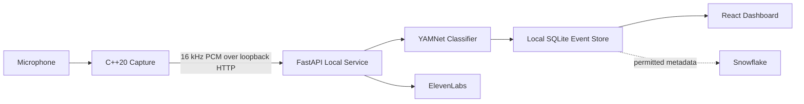

# Live Sound Radar

**Live Sound Radar** is an accessibility-focused application that listens for environmental sounds, classifies them locally, and turns important detections into clear visual alerts.

The current demo focuses on recognizing **knocking** and **doorbells** using a single microphone.

“Radar” refers to environmental sound awareness. The application does **not** estimate the direction, distance, or physical location of a sound.

## What it does

Live Sound Radar provides a privacy-first pipeline for environmental sound awareness:

1. A C++ process captures microphone audio.
2. Audio is resampled locally to 16 kHz mono PCM.
3. A local Python service runs YAMNet sound classification.
4. Detected events are stored locally as metadata.
5. A React dashboard displays live detections and event history.
6. Users can acknowledge detections and control listening/privacy settings.
7. Optional ElevenLabs integration can generate spoken alert messages.
8. Snowflake integration is being used for acoustic-event analytics and AI-generated activity summaries.

Raw microphone audio stays on the local device.

## Architecture



### Main technologies

**Audio capture**
- C++20
- miniaudio
- cpp-httplib
- CMake

**Local inference and backend**
- Python
- FastAPI
- Uvicorn
- TensorFlow
- TensorFlow Hub
- YAMNet
- NumPy
- SQLite

**Frontend**
- React
- TypeScript
- Vite
- Tailwind CSS
- shadcn/ui / Radix
- Vitest

**Optional integrations**
- ElevenLabs text-to-speech
- Snowflake analytics and `AI_COMPLETE`

---

# Quick start

The project was primarily developed and tested on Windows.

## Prerequisites

Install:

- Git
- Python 3.11+
- Node.js and npm
- CMake 3.24+
- A C++20 compiler
- A microphone for live capture

MinGW-w64/GCC was used for the verified C++ build.

---

## 1. Clone the repository

```powershell
git clone https://github.com/ItsJustJean/acoustic-intelligence.git
cd acoustic-intelligence
```

---

# Run the frontend only

If you only want to see the dashboard without running the sound-classification backend, the frontend includes mock data.

```powershell
cd web
npm ci

$env:VITE_USE_MOCK_API="true"

npm run dev
```

Open:

```text
http://127.0.0.1:5173
```

Mock mode lets you explore the interface without requiring TensorFlow, YAMNet, a microphone, or external services.

---

# Run the local inference service

## 2. Create the Python environment

From the repository root:

```powershell
cd aiAudio_Processing

python -m venv .venv
.\.venv\Scripts\Activate.ps1

python -m pip install --upgrade pip
python -m pip install -r requirements-local.lock
```

---

## 3. Download YAMNet

The application intentionally does not download the model automatically at runtime.

Run:

```powershell
python scripts\download_model.py
```

This downloads YAMNet into:

```text
aiAudio_Processing/models/yamnet
```

Set the model location:

```powershell
$env:MODEL_DIR = (Resolve-Path ".\models\yamnet").Path
```

Optional local configuration:

```powershell
$env:LOCAL_DB_PATH = "$PWD\data\events.sqlite3"
$env:RETENTION_DAYS = "1"
```

---

## 4. Start FastAPI

Still inside `aiAudio_Processing`:

```powershell
python -m uvicorn api:app --host 127.0.0.1 --port 8000
```

Health checks:

```text
http://127.0.0.1:8000/health/live
http://127.0.0.1:8000/health/ready
```

`/health/ready` becomes ready after YAMNet finishes loading.

---

# Run the React dashboard with the real backend

Open another PowerShell window:

```powershell
cd acoustic-intelligence\web

npm ci

$env:VITE_USE_MOCK_API="false"

npm run dev
```

Open:

```text
http://127.0.0.1:5173
```

The Vite development server proxies `/v1` requests to:

```text
http://127.0.0.1:8000
```

---

# Build the C++ microphone capture process

From the repository root:

```powershell
cmake -S capture -B build/capture -G "MinGW Makefiles" -DCMAKE_BUILD_TYPE=Debug

cmake --build build/capture --parallel
```

Run its tests:

```powershell
ctest --test-dir build/capture -C Debug --output-on-failure
```

List available microphones:

```powershell
.\build\capture\bin\radar_capture.exe list
```

Test microphone capture without sending audio:

```powershell
.\build\capture\bin\radar_capture.exe smoke --seconds 3
```

---

# Connect the microphone capture process

The capture process communicates only with the local FastAPI service.

For authenticated local capture, use the same token for both processes.

Before starting FastAPI:

```powershell
$env:CAPTURE_TOKEN = "replace-with-a-local-random-token"
```

Start FastAPI:

```powershell
cd aiAudio_Processing
.\.venv\Scripts\Activate.ps1

$env:MODEL_DIR = (Resolve-Path ".\models\yamnet").Path
$env:CAPTURE_TOKEN = "replace-with-a-local-random-token"

python -m uvicorn api:app --host 127.0.0.1 --port 8000
```

In another terminal from the repository root:

```powershell
$env:CAPTURE_BACKEND_URL = "http://127.0.0.1:8000"
$env:CAPTURE_TOKEN = "replace-with-a-local-random-token"

.\build\capture\bin\radar_capture.exe run
```

The capture process sends a heartbeat to FastAPI every 500 ms.

Actual microphone capture remains off until **Start Listening** is enabled from the application settings/dashboard.

---

# Using Live Sound Radar

Once all three components are running:

```text
C++ Capture
     ↓
FastAPI + YAMNet
     ↓
React Dashboard
```

Open the dashboard and:

1. Click **Start Listening**.
2. Make a knocking or doorbell-like sound near the microphone.
3. The local model evaluates the incoming audio.
4. Supported detections appear on the dashboard as:
   - **Possible knocking**
   - **Possible doorbell**
5. The interface displays the model score and recommended action.
6. Press **Acknowledge** after reviewing an alert.
7. Event history remains available locally according to the selected retention period.

The dashboard intentionally describes detections as **possible** events rather than guaranteed classifications.

---

# ElevenLabs spoken alerts

ElevenLabs is optional.

Set these variables before starting FastAPI:

```powershell
$env:ELEVENLABS_API_KEY = "your-api-key"
$env:ELEVENLABS_VOICE_ID = "your-voice-id"
$env:ELEVENLABS_MODEL_ID = "eleven_multilingual_v2"
```

Then enable **Speech** in the dashboard.

The application sends fixed alert text such as:

```text
Possible knocking detected. Check the door.
```

or:

```text
Possible doorbell detected. Check the door.
```

to ElevenLabs.

Raw microphone audio is **not** sent to ElevenLabs.

Generated audio uses:

```text
mp3_44100_128
```

The dashboard pauses detection processing during spoken-alert playback to avoid detecting its own output.

---

# Snowflake analytics

The Snowflake adapter lives in:

```text
cloud/analytics/
```

It supports:

- Deduplicated acoustic-event insertion
- Event expiration
- Device-event deletion
- Acoustic activity counts
- AI-generated summaries using Snowflake `AI_COMPLETE`

Install its dependencies:

```powershell
python -m venv build\venv-analytics

.\build\venv-analytics\Scripts\python.exe -m pip install -r cloud\analytics\requirements-analytics.lock
```

Required Snowflake configuration includes:

```text
SNOWFLAKE_ACCOUNT
SNOWFLAKE_USER
SNOWFLAKE_PRIVATE_KEY_B64
or
SNOWFLAKE_PRIVATE_KEY_PATH

SNOWFLAKE_ROLE
SNOWFLAKE_WAREHOUSE
SNOWFLAKE_DATABASE
SNOWFLAKE_SCHEMA
```

Optional:

```text
SNOWFLAKE_AI_MODEL
SNOWFLAKE_PRIVATE_KEY_PASSPHRASE
```

Run the account self-test after configuring credentials:

```powershell
python -m cloud.analytics.selftest
```

See [`sql/README.md`](sql/README.md) for table setup, key-pair authentication, and Snowflake privileges.

---

# Privacy design

Privacy is a central part of Live Sound Radar.

### Raw audio

Raw microphone audio:

- is captured locally,
- travels only over loopback HTTP between the C++ capture process and local Python backend,
- is used for local inference,
- is not persisted by the application,
- is not uploaded to Snowflake,
- is not sent to ElevenLabs.

### Stored data

Local SQLite storage contains detection metadata such as:

- event ID,
- event type,
- timestamp,
- model score,
- acknowledgement state,
- processing diagnostics.

Cloud-related features are designed to require explicit user controls.

---

# Current implementation status

### Working locally

The current FastAPI service implements:

- YAMNet model loading
- WAV fixture classification
- C++ capture heartbeat
- PCM audio ingestion
- Continuous local sound classification
- Local SQLite event persistence
- `/v1/state`
- `/v1/events`
- event acknowledgement
- `/v1/settings`
- settings updates
- ElevenLabs speech generation
- playback coordination

The frontend implements:

- live system-state polling
- listening controls
- latest-detection alerts
- detection history
- acknowledgement
- settings and privacy controls
- spoken-alert playback
- UI flows for history deletion and Snowflake activity summaries
- automated component and state tests

### Still being integrated

The current `main` FastAPI service does not yet expose these frontend-requested routes:

```text
POST /v1/summary
POST /v1/privacy/delete
GET  /v1/jobs/{job_id}
```

The Snowflake analytics adapter exists and is tested separately, but still needs to be connected to the local/cloud API flow for end-to-end summaries.

Cloud persistence is also not required for the local sound-detection pipeline to function.

---

# Testing

## Python

From `aiAudio_Processing`:

```powershell
python -m pytest ..\tests
```

## Frontend

From `web`:

```powershell
npm run lint
npm run build
npm test
```

## C++

From the repository root:

```powershell
ctest --test-dir build/capture -C Debug --output-on-failure
```

Additional capture integration tests are documented in:

[`capture/README.md`](capture/README.md)

---

# Project structure

```text
acoustic-intelligence/
│
├── capture/
│   ├── include/
│   ├── src/
│   └── tests/
│
├── aiAudio_Processing/
│   ├── api.py
│   ├── classifier.py
│   ├── detector.py
│   ├── pipeline.py
│   ├── speech.py
│   ├── storage.py
│   └── models/
│
├── web/
│   └── src/
│       ├── components/
│       ├── hooks/
│       ├── services/
│       ├── mocks/
│       └── types/
│
├── cloud/
│   └── analytics/
│
├── sql/
├── docs/
└── tests/
```

---

# Development principles

Live Sound Radar is designed around a few important constraints:

- Local inference first
- No raw-audio cloud storage
- Visual alerts are the primary accessibility mechanism
- Spoken alerts are supplementary
- No fabricated sound direction or distance
- Explicit controls for listening and optional external services
- Shared API contracts between C++, Python, and React

For the audio transport contract, see:

[`docs/audio-contract.md`](docs/audio-contract.md)

---

## Built at ShellHacks

Live Sound Radar was developed as a three-person hackathon project focused on combining local AI sound recognition, accessibility, privacy controls, cloud analytics, and assistive user interaction.