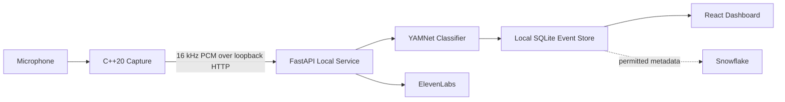

# Live Sound Radar

[](https://github.com/javierGuerraDevelop/acoustic-intelligence/actions/workflows/ci.yml)
[](LICENSE)

**Live Sound Radar** is a privacy-first, accessibility-focused dashboard that listens for environmental sounds, classifies them locally, and turns important detections into clear visual alerts. The current demo recognizes **knocking** and **doorbells** from a single microphone, built as a three-part system: a C++20 capture process, a local FastAPI + YAMNet inference service, and a React dashboard. Optional integrations add ElevenLabs spoken alerts and Snowflake acoustic-event analytics.

“Radar” refers to environmental sound awareness. The application does **not** estimate the direction, distance, or physical location of a sound.

> This repository is a personal fork of [ItsJustJean/acoustic-intelligence](https://github.com/ItsJustJean/acoustic-intelligence), the original three-person hackathon project. The commands below clone **this fork**:
>
> ```text
> https://github.com/javierGuerraDevelop/acoustic-intelligence.git
> ```

## What it does

Live Sound Radar provides a privacy-first pipeline for environmental sound awareness:

1. A C++ process captures microphone audio.
2. Audio is resampled locally to 16 kHz mono PCM.
3. A local Python service runs YAMNet sound classification.
4. Detected events are stored locally as metadata.
5. A React dashboard displays live detections and event history.
6. Users can acknowledge detections and control listening/privacy settings.
7. Optional ElevenLabs integration can generate spoken alert messages.
8. Optional Snowflake integration provides acoustic-event analytics and AI-generated activity summaries.

Raw microphone audio stays on the local device.

## Architecture



### Main technologies

**Audio capture**

- C++20
- miniaudio
- cpp-httplib
- CMake

**Local inference and backend**

- Python
- FastAPI
- Uvicorn
- TensorFlow
- TensorFlow Hub
- YAMNet
- NumPy
- SQLite

**Frontend**

- React
- TypeScript
- Vite
- Tailwind CSS
- shadcn/ui / Radix
- Vitest

**Optional integrations**

- ElevenLabs text-to-speech
- Snowflake analytics and `AI_COMPLETE`

## Contents

- [Quick start](#quick-start)
- [Run the frontend only (mock mode)](#run-the-frontend-only-mock-mode)
- [Run the local inference service](#run-the-local-inference-service)
- [Run the dashboard against the real backend](#run-the-dashboard-against-the-real-backend)
- [Build and run the C++ capture process](#build-and-run-the-c-capture-process)
- [Using Live Sound Radar](#using-live-sound-radar)
- [ElevenLabs spoken alerts](#elevenlabs-spoken-alerts)
- [Snowflake analytics](#snowflake-analytics)
- [Testing](#testing)
- [Privacy design](#privacy-design)
- [Current implementation status](#current-implementation-status)
- [Project structure](#project-structure)
- [Development principles](#development-principles)
- [License](#license)

## Quick start

The project is verified to build and run on **Linux** and was originally developed on **Windows 11** (MinGW-w64/GCC). Every multi-step command below is shown for POSIX shells (`bash`, `zsh`) and PowerShell.

### Prerequisites

- Git
- **Python 3.11–3.13** (3.13 verified). TensorFlow 2.21 does not ship wheels for Python 3.14, so 3.14 is not supported yet.
- Node.js 24 LTS and npm
- CMake 3.24+
- A C++20 compiler (GCC 15.2 MinGW-w64 verified on Windows; GCC/Clang on Linux)
- A microphone for live capture — the capture process also has headless `fixture` and `--null-backend` modes

### 1. Clone the repository

```bash
git clone https://github.com/javierGuerraDevelop/acoustic-intelligence.git
cd acoustic-intelligence
```

```powershell
git clone https://github.com/javierGuerraDevelop/acoustic-intelligence.git
cd acoustic-intelligence
```

## Run the frontend only (mock mode)

If you only want to see the dashboard without running the sound-classification backend, the frontend includes contract-valid mock data.

```bash
cd web
npm ci
VITE_USE_MOCK_API=true npm run dev
```

```powershell
cd web
npm ci
$env:VITE_USE_MOCK_API = "true"
npm run dev
```

Open <http://127.0.0.1:5173>.

Mock mode lets you explore the interface without TensorFlow, YAMNet, a microphone, or external services. See [`web/README.md`](web/README.md) for details.

## Run the local inference service

### 2. Create the Python environment

From the repository root, enter the backend directory and create a virtual environment:

```bash
cd aiAudio_Processing
python3.13 -m venv .venv
.venv/bin/python -m pip install --upgrade pip
.venv/bin/python -m pip install -r requirements-local.lock
```

If `python3.13` is not on your `PATH`, use any `python3`/`python` that reports 3.11–3.13 (`python3 --version`).

```powershell
cd aiAudio_Processing
python -m venv .venv
.\.venv\Scripts\python.exe -m pip install --upgrade pip
.\.venv\Scripts\python.exe -m pip install -r requirements-local.lock
```

### 3. Download YAMNet (required one-time step)

The application intentionally does **not** download the model at runtime, and the model is not committed to the repository. Run the explicit setup script:

```bash
.venv/bin/python scripts/download_model.py
```

```powershell
.\.venv\Scripts\python.exe scripts\download_model.py
```

This downloads YAMNet into `aiAudio_Processing/models/yamnet`. The script **refuses to overwrite an existing `models/yamnet`** and exits with an error instead, so re-running it is safe but unnecessary. To place the model elsewhere, pass `--output <directory>` and point `MODEL_DIR` at that directory.

`models/` and the SQLite `data/` directory are gitignored.

### 4. Start FastAPI

Still inside `aiAudio_Processing`, point the service at the downloaded model and start it:

```bash
MODEL_DIR="$PWD/models/yamnet" .venv/bin/python -m uvicorn api:app --host 127.0.0.1 --port 8000
```

```powershell
$env:MODEL_DIR = (Resolve-Path ".\models\yamnet").Path
.\.venv\Scripts\python.exe -m uvicorn api:app --host 127.0.0.1 --port 8000
```

Health checks:

```text
http://127.0.0.1:8000/health/live    -> {"status":"alive"}
http://127.0.0.1:8000/health/ready   -> {"status":"ready","model":"YAMNet"}
```

```bash
curl http://127.0.0.1:8000/health/ready
```

`/health/ready` returns `503` until YAMNet finishes loading. Model warm-up takes a few seconds on the first start.

Optional configuration uses the same environment-variable style on both platforms (see [`aiAudio_Processing/.env.example`](aiAudio_Processing/.env.example)):

| Variable | Default | Purpose |
| --- | --- | --- |
| `MODEL_DIR` | *(required)* | Directory containing the downloaded YAMNet `saved_model.pb`. |
| `LOCAL_DB_PATH` | `aiAudio_Processing/data/events.sqlite3` | Local SQLite event store path. |
| `RETENTION_DAYS` | `1` | Local retention; must be `1` or `7`. |
| `CAPTURE_TOKEN` | *(empty)* | When set, `POST /v1/audio/chunks` and `POST /v1/capture/heartbeat` require `Authorization: Bearer <token>`. The capture process must use the same value. |
| `ELEVENLABS_API_KEY`, `ELEVENLABS_VOICE_ID` | *(empty)* | Enable optional spoken alerts. |
| `ELEVENLABS_MODEL_ID` | `eleven_multilingual_v2` | ElevenLabs model used for speech. |

## Run the dashboard against the real backend

In another terminal, from the repository root:

```bash
cd web
npm ci
VITE_USE_MOCK_API=false npm run dev
```

```powershell
cd web
npm ci
$env:VITE_USE_MOCK_API = "false"
npm run dev
```

Open <http://127.0.0.1:5173>. The Vite development server proxies `/v1` requests to `http://127.0.0.1:8000`.

## Build and run the C++ capture process

From the repository root:

```bash
cmake -S capture -B build/capture -DCMAKE_BUILD_TYPE=Debug
cmake --build build/capture --parallel
ctest --test-dir build/capture --output-on-failure
```

On Windows, use the MinGW Makefiles generator that produced the original verified build:

```powershell
cmake -S capture -B build/capture -G "MinGW Makefiles" -DCMAKE_BUILD_TYPE=Debug
cmake --build build/capture --parallel
ctest --test-dir build/capture -C Debug --output-on-failure
```

The first configure downloads pinned dependencies (miniaudio, cpp-httplib, nlohmann/json).

Inspect devices and test capture:

```bash
build/capture/bin/radar_capture list
build/capture/bin/radar_capture smoke --seconds 3          # live microphone RMS diagnostics
build/capture/bin/radar_capture smoke --null-backend       # headless callback timing
build/capture/bin/radar_capture fixture --seconds 6        # synthetic tone through the pipeline
build/capture/bin/radar_capture run                        # supervised capture + sender
```

```powershell
.\build\capture\bin\radar_capture.exe list
.\build\capture\bin\radar_capture.exe smoke --seconds 3
.\build\capture\bin\radar_capture.exe smoke --null-backend
.\build\capture\bin\radar_capture.exe fixture --seconds 6
.\build\capture\bin\radar_capture.exe run
```

The binary is `build/capture/bin/radar_capture` on Linux/macOS and `build\capture\bin\radar_capture.exe` on Windows.

### Connect capture to the backend

Use the same `CAPTURE_TOKEN` for both the backend and the capture process.

With the backend running without a token (default):

```bash
CAPTURE_BACKEND_URL=http://127.0.0.1:8000 build/capture/bin/radar_capture run
```

```powershell
$env:CAPTURE_BACKEND_URL = "http://127.0.0.1:8000"
.\build\capture\bin\radar_capture.exe run
```

With a token, set it before starting FastAPI and use the same value for capture:

```bash
cd aiAudio_Processing
CAPTURE_TOKEN="replace-with-a-local-random-token" \
MODEL_DIR="$PWD/models/yamnet" \
.venv/bin/python -m uvicorn api:app --host 127.0.0.1 --port 8000
```

```powershell
cd aiAudio_Processing
$env:CAPTURE_TOKEN = "replace-with-a-local-random-token"
$env:MODEL_DIR = (Resolve-Path ".\models\yamnet").Path
.\.venv\Scripts\python.exe -m uvicorn api:app --host 127.0.0.1 --port 8000
```

In another terminal, from the repository root, start capture with the same token:

```bash
CAPTURE_BACKEND_URL=http://127.0.0.1:8000 \
CAPTURE_TOKEN="replace-with-a-local-random-token" \
build/capture/bin/radar_capture run
```

```powershell
$env:CAPTURE_BACKEND_URL = "http://127.0.0.1:8000"
$env:CAPTURE_TOKEN = "replace-with-a-local-random-token"
.\build\capture\bin\radar_capture.exe run
```

The capture process sends a heartbeat to FastAPI every 500 ms. Actual microphone capture remains off until **Start Listening** is enabled from the dashboard settings; capture then follows the returned capture lease and stops within about two seconds if the lease is not renewed.

## Using Live Sound Radar

Once all three components are running:

```text
C++ Capture
     ↓
FastAPI + YAMNet
     ↓
React Dashboard
```

Open the dashboard and:

1. Click **Start Listening**.
2. Make a knocking or doorbell-like sound near the microphone.
3. The local model evaluates the incoming audio.
4. Supported detections appear on the dashboard as:
   - **Possible knocking**
   - **Possible doorbell**
5. The interface displays the model score and a recommended action.
6. Press **Acknowledge** after reviewing an alert.
7. Event history remains available locally according to the selected retention period.

The dashboard intentionally describes detections as **possible** events rather than guaranteed classifications.

## ElevenLabs spoken alerts

ElevenLabs is optional.

Set these variables before starting FastAPI:

```bash
export ELEVENLABS_API_KEY="your-api-key"
export ELEVENLABS_VOICE_ID="your-voice-id"
export ELEVENLABS_MODEL_ID="eleven_multilingual_v2"
```

```powershell
$env:ELEVENLABS_API_KEY = "your-api-key"
$env:ELEVENLABS_VOICE_ID = "your-voice-id"
$env:ELEVENLABS_MODEL_ID = "eleven_multilingual_v2"
```

Then enable **Speech** in the dashboard. The application sends fixed alert text such as:

```text
Possible knocking detected. Check the door.
```

or:

```text
Possible doorbell detected. Check the door.
```

to ElevenLabs. Raw microphone audio is **not** sent to ElevenLabs. Generated audio uses `mp3_44100_128`. The dashboard pauses detection processing during spoken-alert playback to avoid detecting its own output.

## Snowflake analytics

The Snowflake adapter lives in [`cloud/analytics/`](cloud/analytics/README.md). It supports:

- Deduplicated acoustic-event insertion
- Event expiration
- Device-event deletion
- Acoustic activity counts
- AI-generated summaries using Snowflake `AI_COMPLETE`

Install its dependencies (it is independent of the local service environment):

```bash
python3 -m venv build/venv-analytics
build/venv-analytics/bin/python -m pip install -r cloud/analytics/requirements-analytics.lock
```

```powershell
python -m venv build\venv-analytics
.\build\venv-analytics\Scripts\python.exe -m pip install -r cloud\analytics\requirements-analytics.lock
```

Required Snowflake configuration includes:

```text
SNOWFLAKE_ACCOUNT
SNOWFLAKE_USER
SNOWFLAKE_PRIVATE_KEY_B64
or
SNOWFLAKE_PRIVATE_KEY_PATH

SNOWFLAKE_ROLE
SNOWFLAKE_WAREHOUSE
SNOWFLAKE_DATABASE
SNOWFLAKE_SCHEMA
```

Optional:

```text
SNOWFLAKE_AI_MODEL
SNOWFLAKE_PRIVATE_KEY_PASSPHRASE
```

Run the account self-test after configuring credentials:

```bash
build/venv-analytics/bin/python -m cloud.analytics.selftest
```

See [`sql/README.md`](sql/README.md) for table setup, key-pair authentication, and Snowflake privileges. The Snowflake adapter is not required for the local detection pipeline; when `SNOWFLAKE_*` is configured, the local service wires it into `POST /v1/summary` and `POST /v1/privacy/delete`.

## Testing

### Python

From `aiAudio_Processing`:

```bash
.venv/bin/python -m pytest ../tests -q
```

```powershell
.\.venv\Scripts\python.exe -m pytest ..\tests -q
```

The Python suite uses fake classifiers; it does not need YAMNet or `MODEL_DIR`, and CI runs it the same way.

### Cloud analytics

The Snowflake adapter has its own dependency set and unit suite (DB-API fakes, no live account needed). From the repository root:

```bash
python3 -m venv build/venv-analytics
build/venv-analytics/bin/python -m pip install -r cloud/analytics/requirements-analytics.lock
build/venv-analytics/bin/python -m unittest discover -s cloud/analytics/tests -t .
```

```powershell
python -m venv build\venv-analytics
.\build\venv-analytics\Scripts\python.exe -m pip install -r cloud\analytics\requirements-analytics.lock
.\build\venv-analytics\Scripts\python.exe -m unittest discover -s cloud\analytics\tests -t .
```

### Frontend

From `web`:

```bash
npm run lint
npm run build
npm test
```

### Capture

Unit tests, from the repository root:

```bash
ctest --test-dir build/capture --output-on-failure
```

```powershell
ctest --test-dir build/capture -C Debug --output-on-failure
```

End-to-end scenarios against the built binary and the mock receiver (the driver starts the receiver itself):

```bash
python3 tests/capture/integration_check.py --exe build/capture/bin/radar_capture --scenario lifecycle
python3 tests/capture/integration_check.py --exe build/capture/bin/radar_capture --scenario fixture
python3 tests/capture/integration_check.py --exe build/capture/bin/radar_capture --scenario stall
```

```powershell
python tests\capture\integration_check.py --exe build\capture\bin\radar_capture.exe --scenario lifecycle
python tests\capture\integration_check.py --exe build\capture\bin\radar_capture.exe --scenario fixture
python tests\capture\integration_check.py --exe build\capture\bin\radar_capture.exe --scenario stall
```

All four suites run in GitHub Actions on every push to `main` and every pull request — see [`.github/workflows/ci.yml`](.github/workflows/ci.yml). Additional capture details are documented in [`capture/README.md`](capture/README.md).

## Privacy design

Privacy is a central part of Live Sound Radar.

### Raw audio

Raw microphone audio:

- is captured locally,
- travels only over loopback HTTP between the C++ capture process and the local Python backend,
- is used for local inference,
- is not persisted by the application,
- is not uploaded to Snowflake,
- is not sent to ElevenLabs.

### Stored data

Local SQLite storage contains detection metadata such as:

- event ID,
- event type,
- timestamp,
- model score,
- acknowledgement state,
- processing diagnostics.

Cloud-related features are designed to require explicit user controls.

## Current implementation status

### Working locally

The current FastAPI service implements:

- YAMNet model loading and warm-up
- WAV fixture classification (`POST /classify-file`)
- C++ capture heartbeat (`POST /v1/capture/heartbeat`)
- PCM audio ingestion (`POST /v1/audio/chunks`)
- Continuous local sound classification
- Local SQLite event persistence
- System state and change cursor (`GET /v1/state`)
- Live event history and paging (`GET /v1/events`)
- Event acknowledgement (`POST /v1/events/{event_id}/ack`)
- Settings read/update (`GET`/`PATCH /v1/settings`)
- ElevenLabs speech generation (`POST /v1/speech`)
- Playback coordination (`POST /v1/playback`)
- Background jobs for AI summaries, history deletion, and polling (`POST /v1/summary`, `POST /v1/privacy/delete`, `GET /v1/jobs/{job_id}`)
- Health endpoints (`GET /health/live`, `GET /health/ready`)
- The legacy `GET /events` list

The frontend implements:

- live system-state polling
- listening controls
- latest-detection alerts
- detection history
- acknowledgement
- settings and privacy controls
- spoken-alert playback
- UI flows for history deletion and Snowflake activity summaries
- automated component and state tests

### Snowflake summaries and remote deletion

`POST /v1/summary` and `POST /v1/privacy/delete` return a background `Job` that the dashboard polls through `GET /v1/jobs/{job_id}`; both publish `job.changed` on the `/v1/state` change feed.

- History deletion always clears local SQLite history, disables cloud-storage, analytics, and speech permissions, and advances the local policy epoch. When the Snowflake adapter is configured, the device's cloud events are deleted too.
- AI summaries require `analytics_enabled` plus Snowflake credentials (`SNOWFLAKE_*`). Without them the summary job fails with a visible, retryable `DEPENDENCY_UNAVAILABLE` error instead of fabricating a summary.
- This repository has no MongoDB Atlas integration, so no event metadata is ever uploaded there; the Atlas leg of deletion is complete by construction.

The Snowflake analytics adapter still needs the cloud host (Atlas + export scheduler) for end-to-end cloud sync. Cloud persistence is not required for the local sound-detection pipeline to function.

## Project structure

```text
acoustic-intelligence/
│
├── .github/
│   └── workflows/ci.yml    # Python, web, and capture CI
│
├── capture/                # C++20 capture process
│   ├── include/
│   ├── src/
│   └── tests/
│
├── aiAudio_Processing/     # FastAPI + YAMNet local service
│   ├── api.py
│   ├── analytics.py        # optional Snowflake adapter wiring
│   ├── classifier.py
│   ├── detector.py
│   ├── jobs.py             # /v1/summary and /v1/privacy/delete jobs
│   ├── pipeline.py
│   ├── speech.py
│   ├── storage.py
│   ├── scripts/download_model.py
│   ├── models/             # downloaded YAMNet (gitignored)
│   └── data/               # SQLite event store (gitignored)
│
├── web/                    # React + Vite dashboard
│   └── src/
│       ├── components/
│       ├── hooks/
│       ├── services/
│       ├── mocks/
│       └── types/
│
├── cloud/
│   └── analytics/          # Snowflake adapter
│
├── sql/                    # Snowflake table setup
├── docs/audio-contract.md  # wire format and framing contract
├── tests/                  # Python suite + capture integration drivers
└── LICENSE
```

## Development principles

Live Sound Radar is designed around a few important constraints:

- Local inference first
- No raw-audio cloud storage
- Visual alerts are the primary accessibility mechanism
- Spoken alerts are supplementary
- No fabricated sound direction or distance
- Explicit controls for listening and optional external services
- Shared API contracts between C++, Python, and React

For the audio transport contract, see [`docs/audio-contract.md`](docs/audio-contract.md).

## License

Released under the [MIT License](LICENSE). Copyright (c) 2026 Javier Guerra.

---

## Built at ShellHacks

Live Sound Radar was developed as a three-person hackathon project focused on combining local AI sound recognition, accessibility, privacy controls, cloud analytics, and assistive user interaction.
