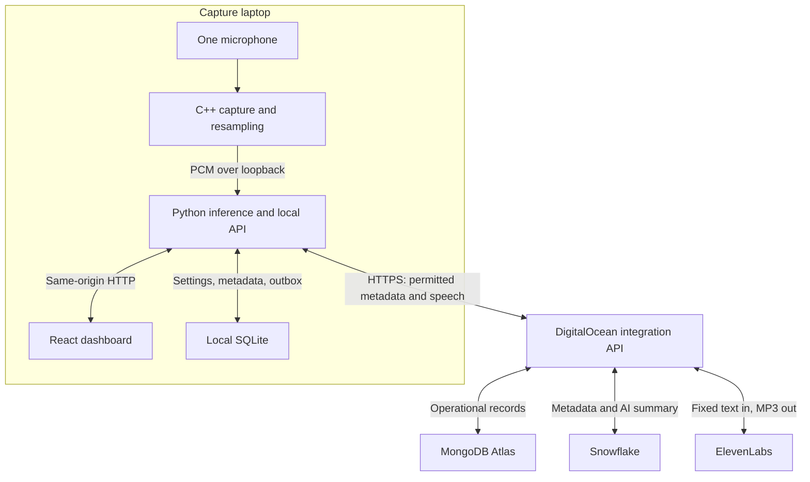

# Live Sound Radar: architecture and 12-hour execution plan

Prepared 26 September 2026. This is an implementation specification, not a generated application. M1, M2, and M3 mean the three team members in your brief. Times are elapsed hours from kickoff.

## 1. Decision and scope

**Build one native laptop application made of a C++ capture process, a local Python service, and a locally served React dashboard. Deploy a separate, small Python integration service to DigitalOcean App Platform.** Raw audio never goes to the integration service. Cloud services receive only permitted metadata or fixed alert text.

The target user is a deaf or hard-of-hearing person working at a desk who wants visual awareness of visitors. The journey is: open dashboard → explicitly start listening → hear a knock or doorbell through the microphone → see “Possible knocking—check the door” → acknowledge the card → optionally hear a spoken version → optionally review cloud-backed history and an AI session summary.

“Radar” means an awareness display. Use a recent-event timeline and a central listening indicator. Do not draw directional bearings, distance rings, room locations, or fabricated sound positions.

### Three scope levels

| Level | Exact scope | Completion evidence |
|---|---|---|
| First local pipeline, by hour 3–4 | One microphone, C++ PCM transport, local YAMNet, two classes, polling dashboard, start/stop, local event history | A real knock produces a classified event on screen with network disconnected |
| All five requirements, by hour 9 | Above; Atlas profile/device/config/event persistence; Snowflake event export plus real `AI_COMPLETE` summary; ElevenLabs speech for a detected event; visible local processing and separate data controls | One event is traceable through real services; summary query and TTS request actually succeed |
| Stretch, only if every acceptance gate is green by hour 8 | Third sound such as a tested alarm label; richer charts; optional automatic speech; configurable per-label thresholds | No regression in local latency, controls, or offline behavior |

Use **two classes: `knock` and `doorbell`**. YAMNet's official map includes `Knock`, `Doorbell`, and `Ding-dong`; resolve their indices from the downloaded model's class map, not numbers copied into code. Map the last two into one `doorbell` class. Label membership is verified; reliability on your actual microphone and venue remains to be tested. [S1, S2]

The MVP supports one demo profile and one laptop. No signup, multi-device fleet, mobile app, custom training, speech recognition, location estimation, remote microphone access, Redis, Kafka, or autonomous emergency response. Optional speech is initially an explicit **Speak alert** action; automatic playback is a stretch feature. This is the smallest faithful speech integration and also simplifies feedback prevention.

**Feasibility:** plausible in 12–14 hours with three agent-assisted streams, but conditional on model and account access working in the first hour. The bottlenecks are service provisioning/permissions and OS/model compatibility, not writing UI components. The baseline already makes the smallest useful scope reductions: two classes, one profile, one summary, speech on demand. Cut animation, extra classes, automatic speech, and extra analytics first. Do not silently replace a required real integration with a mock. If a credential gate remains blocked after hour 2, assign sponsor/help-desk escalation to that integration's owner while continuing locally; all-five completion is then explicitly at risk.

## 2. Architecture and deployment



### Concrete deployment arrangement

- **Demo laptop:** native Windows 11 x64, C++20 built with MSVC/CMake, Python 3.11 virtual environment, CPU inference, Chromium browser. This is a selected demo target, not a requirement to port every teammate's environment. If a teammate already has the whole native pipeline working on Linux by hour 1, designate that laptop instead and freeze the target. Do not split native capture and inference across WSL networking/audio boundaries.
- **C++ process:** no listening network port. Outbound client calls only to `http://127.0.0.1:8000`. Capture defaults off until authorized by the local service.
- **Local Python:** one Uvicorn process on `127.0.0.1:8000`, one inference executor, SQLite metadata store, cloud-sync background worker. Never use multiple Uvicorn workers for this prototype's in-memory state.
- **Browser:** `http://127.0.0.1:8000/`, with Vite's built `dist` served by FastAPI. All UI calls are same-origin `/v1/...`. During development use Vite `127.0.0.1:5173` and proxy `/v1` to port 8000. Do not mix `localhost` and `127.0.0.1` in allowed-origin checks.
- **DigitalOcean:** one App Platform web service, one instance, one Uvicorn worker, Python 3.11 container without TensorFlow. Listen on `0.0.0.0:$PORT`, configured internal port 8080. Use its assigned HTTPS `*.ondigitalocean.app` URL; store secrets as encrypted runtime variables. Enable dedicated egress IPs, and allowlist both assigned addresses in Atlas. This feature is paid and must be provisionable at kickoff; do not assume hackathon credits cover it. [S8–S10]
- **Atlas:** operational persistence; **Snowflake:** analytics and AI; **ElevenLabs:** synthetic speech. No service credentials enter the frontend.

This arrangement avoids an HTTPS website trying to control a microphone through a visitor's localhost. The browser never calls DigitalOcean directly, and DigitalOcean never initiates a connection to the laptop. Browser CORS is therefore unnecessary in the final demo. The local Python process makes outbound HTTPS requests with normal certificate validation. No tunnel, inbound campus firewall exception, public local API, or browser microphone permission is needed; native microphone OS permission is still required.

A publicly accessible cloud health URL is not a remotely usable microphone dashboard. Judges use the demo laptop. Remote viewers are outside baseline scope.

### Boundary inventory

| Boundary | Data crossing | Never sent |
|---|---|---|
| Microphone → C++ → Python | Mono PCM, capture sequence/time, RMS and drop diagnostics | External network audio |
| Python → browser | Classified events, state/settings, optional generated MP3 | Raw microphone PCM or embeddings |
| Python → DigitalOcean | Opted-in event projection, pseudonymous profile/device configuration; separate fixed speech request | PCM, waveform, spectrogram, embeddings, transcript, machine hostname |
| DigitalOcean → Atlas | Operational metadata and settings | Audio |
| DigitalOcean → Snowflake | Smaller event projection, export/delete controls; aggregate counts for AI | User name, voice text, audio, precise hardware identity |
| DigitalOcean → ElevenLabs | Fixed template text and configured voice/model | Event IDs, device IDs, timestamps, raw audio |

Pseudonymous records are not anonymous. Providers still observe ordinary connection information, and a timestamp plus event label can reveal activity.

## 3. Technology choices and immediate validation

| Component | Chosen implementation | Gate before building deeply |
|---|---|---|
| Audio | miniaudio; C++20; preallocated SPSC ring; miniaudio streaming converter in worker | Capture 10 seconds, verify actual sample rate and RMS; stop/restart microphone |
| Local transport | cpp-httplib client, loopback HTTP binary body, keep-alive | Send exact fixture and reject malformed length |
| Classifier | Official YAMNet SavedModel via `tensorflow-hub`, `tensorflow`, NumPy | Download once, load, warm up, find three class-map names, classify actual knock/doorbell examples |
| API | FastAPI, Uvicorn, Pydantic; `httpx` for cloud calls; built-in `sqlite3` | Import/start on selected laptop; pin successful dependency versions |
| UI | React, TypeScript, Vite; native fetch and HTML audio | Render fixture, poll mock API, stop capture and acknowledge with keyboard |
| Operational cloud | PyMongo driver against Atlas | Cloud-hosted process completes ping, write, read, delete |
| Analytics | Official `snowflake-connector-python`; parameterized SQL; `AI_COMPLETE` | Cloud-compatible key-pair auth, table write/read, actual AI response |
| Speech | ElevenLabs REST through `httpx` | Obtain accessible voice ID, synthesize fixed phrase, play returned MP3 |

YAMNet takes a one-dimensional mono float waveform at 16 kHz, normalized to approximately [-1,1], and produces scores for 521 classes. Its internal feature patches are approximately 0.96 seconds with a 0.48-second hop. Our external two-second window is a separate design choice. Download using `hub.load('https://tfhub.dev/google/yamnet/1')` during setup, then load the cached/local model during the demo. Use `model.class_map_path()` to obtain the matching labels. [S1, S3]

Use Python 3.11 as a conservative starting environment. Install TensorFlow, TensorFlow Hub and NumPy into a fresh environment, run a real inference, then freeze exact working versions in `requirements-local.lock`; do not claim an untested set of latest packages is compatible. No `tensorflow-io`, FFmpeg, ONNX conversion, CUDA or GPU is needed in the baseline. Convert wire int16 with `np.frombuffer(body, dtype='<i2').astype(np.float32) / 32768.0`. C++ already resamples.

Official installation documentation supports a native Windows CPU route, requires the appropriate Visual C++ runtime, and distinguishes it from modern GPU support through WSL2. [S4] Planning estimate: a modern x64 laptop with 8 GB RAM or more should be a practical CPU target; that is not an official minimum or measured benchmark. Reserve several GB of installation/download headroom. Measure 20 warm inference calls; target p95 below 500 ms per two-second window so a one-second cadence has headroom. If it fails, first close heavy programs or move the entire local pipeline to the already validated faster laptop.

### Account gate ownership, minutes 0–60

- **M1:** Snowflake account identifier, warehouse/database/schema, connector-compatible service authentication (choose key pair), SQL privileges, Cortex role/function privileges, supported model in that region. The current privilege documentation requires an AI-functions account privilege or per-function privilege plus a qualifying Cortex database role; model availability/access is another gate. Start `SNOWFLAKE_AI_MODEL` with `llama3.3-70b`, a documented model example, and change only if the actual account test requires a permitted model. [S5, S6]
- **M2:** actual laptop TensorFlow inference; DigitalOcean account/billing/repository deployment; Atlas database user and IP access list. Atlas application users and database users are different. [S7]
- **M3:** ElevenLabs API key, accessible voice, actual TTS credit/quota, MP3 playback. Use documented `eleven_multilingual_v2` and `mp3_44100_128`. No free-tier or sponsored-credit promise is made. [S11]

Official judging criteria and sponsor eligibility have not been verified. The five challenge mappings below implement your supplied requirements. No Azure or other Microsoft API is invented as a requirement.

## 4. Ownership and integration rules

| Member | Directories / components | Stack and concepts | Ordered work and edges | Acceptance |
|---|---|---|---|---|
| **M1: systems + Snowflake** | `capture/`, `cloud/analytics/`, `sql/`, `tests/capture/`, `docs/audio-contract.md` | C++20, miniaudio, cpp-httplib, CMake; SPSC ownership, sample clocks, bounded queues; Python connector, MERGE, idempotency | 1 capture fixture; 2 callback/ring/worker; 3 HTTP producer and controls; 4 Snowflake export/AI adapter; 5 latency and analytics validation. Produces PCM to M2; consumes settings; analytics adapter consumes M2 event projections | Native capture, correct resampling, bounded memory, no callback network/allocations; real Snowflake rows and AI result |
| **M2: inference + service host + Atlas** | `local/`, `cloud/app.py`, `cloud/operational/`, `cloud/privacy/`, `contracts/`, `scripts/`, `deploy/`, root build/start docs | Python, FastAPI/Pydantic, TensorFlow, NumPy, SQLite, PyMongo/httpx; inference cadence, consent, retries, route mounting | 1 freeze contracts/model gate; 2 ingest/infer/local API; 3 cloud skeleton/Atlas; 4 consent/export/delete workers; 5 mount teammate adapters. Consumes PCM; exposes UI API; calls M1/M3 adapters | Real offline pipeline; correct local controls; cloud writes gated; failures never stall inference; final assembly |
| **M3: frontend + ElevenLabs** | `web/`, `cloud/speech/`, `tests/ui/`, `docs/demo.md`, `docs/privacy-copy.md` | React/TS/Vite; polling, accessible state, audio autoplay; small Python/httpx router | 1 mock UI; 2 real poll/control wiring; 3 speech router and player; 4 privacy/status/summary UI; 5 rehearsal. Consumes M2 APIs; speech router mounted by M2 | Usable without hearing/color; live history, stop/consent/delete status; real speech playback; honest outage labels |

**One primary owner per contract:** M1 owns audio wire specification; M2 owns canonical event/settings/cloud schemas and internal adapter protocols; M3 owns alert text IDs and UI behavior. M2 commits the frozen copies in `contracts/`; owner-reviewed changes are the only modifications allowed. M2 owns final integration and the Microsoft core-use-case mapping. M1 owns Snowflake. M3 owns ElevenLabs and accessibility. M2 owns Atlas and privacy enforcement; M3 owns the Assurant evidence/UI presentation.

M2 is the critical-path owner. M1/M3 deliver complete adapters, route modules, tests, and setup instructions; M2 only mounts them. M3 also writes the demo/privacy copy, and M1 performs capture/analytics integration tests. After hour 4, M2 spends no time polishing charts or tuning spoken phrasing. If M2 falls behind, transfer a whole named file/task at a checkpoint; do not allow two agents to edit it concurrently.

Each member uses a separate branch and their own coding agent. Shared fixture/schema changes are reviewed at the next checkpoint. Merge small buildable slices at hours 1, 2, 3.5, 5.5 and 8.5. No agent may redesign the process boundaries or upgrade locked dependencies without the contract owner's approval.

## 5. Exact shared contracts

### 5.1 Common rules

All routes below are **application routes that your team implements**, except the explicitly identified ElevenLabs endpoint. `L` means `http://127.0.0.1:8000`; `C` means the deployed DigitalOcean HTTPS origin.

- JSON schemas use `schema_version: 1`. Required fields are those shown in examples unless explicitly called optional. Reject unknown fields on writes with 422. Units are part of names or defined below. UTF-8 JSON; maximum ordinary JSON body 256 KiB, individual event 4 KiB.
- IDs are UUID strings, except counters and listed enums. Timestamps are UTC RFC 3339 strings with milliseconds and `Z`; convert to database timestamp types. Durations and latency are milliseconds. All float inputs must be finite.
- Error response: `{"schema_version":1,"error":{"code":"MODEL_NOT_READY","message":"Model warming up","retryable":true},"request_id":"<uuid>"}`. 400 malformed request, 401 missing/bad token, 403 consent/ownership denied, 404 missing record, 409 stale revision/epoch, 413 size, 415 content type, 422 schema/value, 429 capacity, 503 dependency unavailable, 504 upstream deadline. Never return secrets or stack traces.
- Browser mutations require an unpredictable local UI token in `X-Local-Token`, bootstrapped through the local same-origin page; validate exact `Origin` and Host. JSON-only control endpoints, no permissive CORS. C++ uses a different launcher-provided `CAPTURE_TOKEN` in `Authorization: Bearer ...`. Neither token can call the cloud directly.
- Python → cloud uses `Authorization: Bearer <CLOUD_DEVICE_TOKEN>`, a random preprovisioned single-device demo token stored only on the laptop/backend. The cloud maps it to the authorized pseudonymous profile/device; do not trust body IDs for authorization. Configure the same scoped mapping in encrypted cloud settings. This is a one-device prototype, not general account authentication.
- UI requests: 2-second deadline except summary, speech and deletion job calls as specified. Retry reads after 1/2/4 seconds, max 5 seconds between attempts. Mutation retries reuse the same `request_id`; servers remember recent results (100 IDs, 10 minutes), and persistent mutations are inherently idempotent too.
- Local cloud outbox: SQLite, at most 1,000 events, maximum age equal to retention; retries after 1/2/4/8/30 seconds with jitter and 30-second cap. One batch in flight. If full, stop enqueueing new cloud copies and show a dropped-copy count; local detection continues. Never drop pending consent/deletion controls to make space. No past event is newly queued merely because consent becomes enabled later.

### 5.2 Edge 1 — C++ → Python audio

**Owner:** M1 producer, M2 consumer. `POST L/v1/audio/chunks`, `Content-Type: application/octet-stream`, capture bearer token. Body is exactly **32,000 bytes**: 16,000 mono samples of signed 16-bit little-endian PCM, no WAV header/base64. One complete one-second chunk per HTTP request; reject anything else. 32,000-byte body limit on this route.

Required headers:

```text
X-Schema-Version: 1
X-Device-Id: 70c4af1d-9b7c-4c28-a66c-a87489376e42
X-Stream-Id: fa986755-08b7-4bb2-b324-f5d17243539c
X-Chunk-Seq: 42
X-Start-Sample: 672000
X-Captured-At: 2026-09-26T18:00:00.000Z
X-Sample-Rate: 16000
X-Channels: 1
X-Encoding: pcm_s16le
X-Rms-Dbfs: -24.6
X-Dropped-Frames-Total: 0
```

`chunk_seq` is an integer ≥0, increasing even when a completed chunk is dropped. `start_sample = chunk_seq * 16000` within a contiguous stream. `captured_at` is estimated UTC time of the **first sample**, obtained from stream-start UTC plus sample count, not time of HTTP delivery. `rms_dbfs` is [-120,0], silence floored at -120; diagnostics only, not calibrated sound pressure. Dropped frames are source-rate frames since capture-process launch.

Capture in miniaudio's supported native sample rate, f32 mono callback output; query the actual configured rate. The C++ worker uses a persistent miniaudio converter to produce 16 kHz mono, clips to [-1,1], and encodes s16le. Do not reset the resampler at every callback; account for resampler latency in diagnostics. Python does no second resampling.

Response after validation and enqueue, **not after inference**:

```json
{"schema_version":1,"stream_id":"fa986755-08b7-4bb2-b324-f5d17243539c","chunk_seq":42,"status":"accepted","queue_depth":1}
```

HTTP 202; duplicate `(stream_id, chunk_seq)` returns 200 with `status:"duplicate"` and does not infer twice. Recent accepted IDs retained for 60 seconds. Unknown/closed stream, overlapping/out-of-order chunk or stopped capture: 409. Loading model: 503. Python queue full: 429. Body/header violations: 413/415/422.

Use one sender thread with one request in flight, keep-alive, 200 ms connect timeout, 750 ms total request deadline. **No audio retransmission:** an uncertain response or error discards that chunk and advances. Python resets its rolling window and smoothing whenever sequence numbers skip. Never join separated intervals as if contiguous. Discard chunks whose first sample is over three seconds old. Python audio queue holds at most two chunks; reject the arriving request when full. C++ sender queue holds at most two completed chunks and drops its oldest pending chunk on overload; this is a worker-owned queue, not the callback ring.

A changed microphone, pause/resume, sample-clock discontinuity or callback overflow creates a new `stream_id`. M2 permits one active stream per device and retires the previous stream; delayed old-stream packets are rejected.

**Capture/control reverse edge:** C++ supervisor calls `POST L/v1/capture/heartbeat` every 500 ms with:

```json
{"schema_version":1,"device_id":"70c4af1d-9b7c-4c28-a66c-a87489376e42","stream_id":"fa986755-08b7-4bb2-b324-f5d17243539c","state":"running","native_rate_hz":48000,"dropped_frames_total":0,"error_code":null}
```

`stream_id` may be null while stopped; `state` is `stopped|starting|running|error`; `native_rate_hz` is positive or null before device initialization; `error_code` is null or a short diagnostic string. Reply 200:

```json
{"schema_version":1,"desired_capture":true,"lease_ms":2000,"settings_revision":4}
```

If the lease expires, stop the actual audio device and clear buffers. Stop/start only from the supervisor, never the callback. A UI stop immediately stops Python ingestion/inference, and C++ closes/stops capture at the next heartbeat; show `stopping` until its acknowledgement, normally within 500 ms. If the backend disappears, the lease closes capture within two seconds. [S12]

### 5.3 Canonical detection event

```json
{
  "schema_version": 1,
  "event_id": "67e3664e-8f10-43d6-b2eb-ae0bf27d94df",
  "device_id": "70c4af1d-9b7c-4c28-a66c-a87489376e42",
  "stream_id": "fa986755-08b7-4bb2-b324-f5d17243539c",
  "event_seq": 7,
  "window_start_at": "2026-09-26T17:59:59.000Z",
  "occurred_at": "2026-09-26T18:00:01.000Z",
  "detected_at": "2026-09-26T18:00:01.180Z",
  "label": "knock",
  "model_score": 0.74,
  "severity": "info",
  "action_id": "check_door",
  "source": "microphone",
  "processing": {
    "model_id": "yamnet/1",
    "rule_version": "demo-1",
    "sample_rate_hz": 16000,
    "window_ms": 2000,
    "hop_ms": 1000,
    "last_chunk_seq": 42,
    "inference_ms": 116,
    "capture_to_detection_ms": 180,
    "rms_dbfs": -24.6,
    "dropped_frames_total": 0
  }
}
```

All fields above required. `event_seq` increases within a stream; it is not a global ordering mechanism. `occurred_at` is the window-end timestamp, **not a claim of precise acoustic onset**. `capture_to_detection_ms = detected_at - occurred_at`; it excludes the audio accumulation window and is not the full user-perceived response time. Measure stimulus-to-visible latency separately in rehearsal.

`label` enum `knock|doorbell`; `severity` enum `info|attention`, with knock→info and doorbell→attention as UI priorities, not estimates of physical danger. `action_id` is `check_door`. `source` is `microphone|fixture`; playback of a recording into the actual microphone is still `microphone`, and the presenter discloses the staged sound. `model_score` is a finite [0,1] model output aggregate, **not calibrated confidence or probability**. UI says “Model score 0.74,” never “74% certain.” No additional labels without a versioned contract update.

Event immutable after creation. Acknowledgement and delivery status are separate record fields, not edits to classification. Optional diagnostics are omitted entirely from cloud projection unless allowlisted below.

### 5.4 Edge 2 — dashboard live state and history

**M2 producer; M3 consumer. Choose HTTP polling every 250 ms.** At one viewer, four small requests/second are inexpensive and straightforward to mock. Extra display delay is at most roughly one poll interval under normal conditions. SSE/WebSocket adds reconnect/cursor/auth handling that this MVP does not need. Pause polling in hidden tabs and immediately refresh on focus.

`GET L/v1/state?after=31&instance_id=<uuid>` returns 200:

```json
{
  "schema_version":1,
  "instance_id":"6c06a44e-419f-4f50-9ad4-9e402a2c534b",
  "cursor":32,
  "reset_required":false,
  "status":{"capture":"running","model":"ready","cloud":"online","export_pending":1,"export_dropped":0,"audio_gaps":0},
  "changes":[{"cursor":32,"type":"event.created","event_id":"67e3664e-8f10-43d6-b2eb-ae0bf27d94df","data":{"event":"<canonical event object>"}}]
}
```

`<canonical event object>` here denotes the actual nested object in 5.3, not a literal string in implemented fixtures. Change `type` enum is `event.created|event.acknowledged|settings.changed|job.changed|history.cleared`. Data schemas respectively: `{event: Event}`, `{event_id, acknowledged_at}`, `{settings: Settings}`, `{job: Job}`, `{deletion_id}`. Every change has monotonic local `cursor`, type and data; `event_id` outside data is optional and present only for event changes. Status capture enum `stopped|starting|running|stopping|error`; model `loading|ready|error`; cloud `disabled|online|degraded|offline`. All counters are nonnegative integers.

One request in flight per browser; changes sorted by cursor. Keep 500 changes in memory, return max 100 per poll; returned cursor is the last included change, never beyond undispatched changes. A mismatched instance or expired cursor returns `reset_required:true`, `changes:[]`, current cursor; UI reloads history/settings and resumes after that cursor. Backend restart creates a new instance UUID.

`GET L/v1/events?limit=50&before=<opaque-cursor>` returns `{schema_version:1, items:[{event:Event, acknowledged_at:null}], next_cursor:null}`. `limit` 1–100; `before` optional; newest first by `(occurred_at,event_id)`. `acknowledged_at` is nullable timestamp. Invalid cursor 422. UI upserts by event ID so refreshes never duplicate cards. Retain up to 1,000 local records within selected retention. History is local SQLite and remains available offline; Atlas persistence is shown separately, not synchronously queried on every poll.

GETs retry on transport/503/504. Show disconnected after two seconds without successful state; do not continue showing a healthy live indicator. On reconnect, restore state without replaying speech or popping every historical alert. Status fields accompany every poll, so status updates do not consume change-buffer capacity.

### 5.5 Edge 3 — UI settings, consent, device control and acknowledgement

M3 caller; M2 implementation; M1 consumes effective capture control. `GET L/v1/settings` returns:

```json
{
  "schema_version":1,
  "revision":4,
  "capture_enabled":true,
  "cloud_storage_enabled":false,
  "analytics_enabled":false,
  "speech_enabled":false,
  "retention_days":1,
  "cooldown_seconds":10,
  "muted_until":null
}
```

Defaults: capture and all external permissions false; retention 1 day; cooldown 10 seconds. `retention_days` enum `1|7`; `cooldown_seconds` integer 5–60; mute timestamp null or at most one hour ahead. `analytics_enabled` requires cloud storage; speech is independent. Native capture resets false on each application launch even if preferences were persisted.

`PATCH L/v1/settings` body `{schema_version:1,request_id:<uuid>,expected_revision:4,changes:{cloud_storage_enabled:true,analytics_enabled:true}}`. All top-level fields required; `changes` contains one or more writable settings above. Respond 200 with updated Settings plus `cloud_sync:"not_needed|pending|complete"`. Stale revision 409; illegal consent combination 422. Privacy switches take effect locally before cloud synchronization. Network-sensitive enabling becomes effective only after cloud policy acknowledgement; show pending until then. Disabling immediately stops new local outbound requests and flushes the affected pending event/TTS work. An already in-flight request may finish; do not promise to recall transmitted data.

`POST L/v1/events/{event_id}/ack` with `{schema_version:1,request_id:<uuid>}` → 200 `{schema_version:1,event_id,acknowledged_at}`. Repeated acknowledgement returns the original timestamp. Unknown ID 404. Acknowledgement persists locally and optionally syncs to Atlas; it does not assert that the sound's real-world cause is resolved.

`POST L/v1/privacy/delete` body `{schema_version:1,request_id:<uuid>,scope:"all_history"}` → 202 Job. This one button clears local event history/queued events, disables all external permissions, advances policy epoch, and requests deletion of this device's stored cloud events and summaries. It retains only minimal profile/device configuration and deletion-control metadata, as stated in the confirmation text. No per-event delete in baseline. `GET L/v1/jobs/{job_id}` → Job. Job schema: `{schema_version:1,job_id:<uuid>,kind:"delete|summary",state:"pending|running|complete|failed",updated_at:<timestamp>,result:null,error:null}`; result/error are nullable typed objects. Delete result `{local:"complete",atlas:"complete|pending",snowflake:"complete|pending"}`. Return complete only after both remote stores confirm deletion. Failed/retryable requests remain visibly pending offline. A durable deletion control is never evicted by queue capacity.

### 5.6 Edge 4 — local backend → cloud → MongoDB Atlas

**M2 owns both HTTP endpoints and Atlas adapter.** `PUT C/v1/device-state` synchronizes policy before any other metadata request:

```json
{"schema_version":1,"request_id":"b7a368e4-94bd-4e68-862d-98292306087f","device_id":"70c4af1d-9b7c-4c28-a66c-a87489376e42","policy_epoch":3,"settings_revision":4,"cloud_storage_enabled":true,"analytics_enabled":true,"speech_enabled":false,"retention_days":1,"cooldown_seconds":10}
```

`policy_epoch` is a persistent nonnegative integer advanced whenever any external consent changes or history is deleted. Cloud accepts greater epochs; equal epoch/revision with identical data is idempotent; stale or conflicting values 409. Response 200 `{schema_version:1,policy_epoch:3,settings_revision:4}` only after Atlas acknowledgement. Disabling/deletion controls remain permissible even when storage is disabled. No silent cloud-to-local settings overwrite: the laptop is the sole settings writer.

On first opted-in storage sync, upsert one synthetic user (`display_name:"Demo user"`), one device (`display_name:"Demo laptop"`) and its configuration. Do not collect email, real name or computer hostname.

`POST C/v1/events/batch`, at most 25 events and 128 KiB, triggered every five seconds or 25 pending events:

```json
{"schema_version":1,"request_id":"47b49c02-41c2-496e-a4a6-aa6e3d337d32","policy_epoch":3,"events":[{"schema_version":1,"event_id":"67e3664e-8f10-43d6-b2eb-ae0bf27d94df","device_id":"70c4af1d-9b7c-4c28-a66c-a87489376e42","occurred_at":"2026-09-26T18:00:01.000Z","label":"knock","model_score":0.74,"severity":"info","model_id":"yamnet/1","rule_version":"demo-1","source":"microphone","retention_days":1}]}
```

This explicit projection is the entire allowed external event payload; no `processing`, stream ID, waveform or arbitrary strings. All fields required. `retention_days` must equal current policy; late events cannot renew their lifetime. `expires_at` is derived from event time, not arrival. Reject future timestamps beyond 60 seconds, already expired data, another device, fixtures in real mode, or disabled policy. Events captured before this epoch's enable time are not accepted.

Response 200 `{schema_version:1,accepted:[<event-id>],duplicates:[],rejected:[]}` after durable Atlas acknowledged writes. Rejected items are `{event_id,code}`; local drops terminal validation/expired items with visible counters. An unavailable Atlas connection returns 503; do not acknowledge memory-only persistence. Partial writes followed by failure are safe to retry using immutable event IDs.

Atlas uses `update_one({_id:event_id}, {$setOnInsert:record}, upsert=True)`. Same ID and same immutable content is duplicate; same ID and different content is 409. The embedded `snowflake_status:"pending"` plus event itself acts as the export outbox: no separate distributed transaction. It is only pending if analytics was permitted at acceptance; enabling analytics does not backfill prior events.

Configure PyMongo TLS/SRV URI, server selection/connect timeout around 2 seconds and socket timeout 3 seconds. Run blocking driver calls off the FastAPI event loop. Local HTTP deadline is 5 seconds. PyMongo talks to the Atlas URI over its database protocol; there is no fabricated MongoDB HTTP API.

Optional acknowledgement sync uses `PUT C/v1/events/{event_id}/ack` with `{schema_version:1,policy_epoch:3,acknowledged_at:<timestamp>}` → 200 identical acknowledgement. Missing event 404 retries only after its batch upload; consent off drops the sync. This is operational metadata and is not exported to Snowflake.

### 5.7 Edge 5 — operational events → Snowflake and AI → UI

**M1 owns adapter/SQL; M2 hosts scheduler/HTTP and supplies database access.** No public Snowflake ingestion route is needed. Freeze these Python adapter interfaces before parallel development:

```python
# Blocking functions; M2 runs them in a dedicated executor.
upsert_events(rows: list[AnalyticsRow]) -> ExportResult
summarize(device_key: str, since_utc: str) -> SummaryResult
delete_events(device_key: str) -> None
purge_expired(now_utc: str) -> int
# ExportResult: {event_ids: list[str], query_id: str}
# SummaryResult: {text: str, event_count: int, counts: dict[str,int],
#                 since: str, through: str, generated_at: str,
#                 model: str, query_id: str}
```

Adapter failures raise a shared `AdapterError(code: str, retryable: bool)` defined by M2 in `contracts/`: `AUTH_FAILED` and `BAD_INPUT` are terminal; `TIMEOUT`, `RATE_LIMITED` and `UNAVAILABLE` are retryable. No secrets appear in errors. In the empty-summary case, `model` and `query_id` may be null; otherwise they are nonempty strings. `counts` contains only `knock`/`doorbell` with nonnegative integer values; text is capped at 1,000 characters. M2 supplies the same database types/fixtures to M1 and M3.

Every 15 seconds, the cloud scheduler loads up to 50 eligible Atlas documents with pending export. It projects each into `AnalyticsRow`: `{schema_version,event_id,analytics_device_id,occurred_at,label,model_score,severity,model_id,rule_version,expires_at}`. UUID `analytics_device_id` is independently generated and stored in the device record; no profile/user ID goes to Snowflake. `source` must be microphone before projection.

M1 issues parameterized `MERGE` keyed on event ID into `ACOUSTIC_EVENTS`. Deduplicate each input batch first. One cloud metadata writer at a time prevents concurrent duplicate MERGEs; ordinary Snowflake table primary-key declarations are not relied upon for uniqueness. Mark Atlas `snowflake_status:"exported"` only after SQL succeeds. If SQL committed but acknowledgement was lost, retry MERGE. Retries at 5/15/60 seconds, capped at 60, with jitter. Keep pending records until expiration; cloud outage must never retain them beyond the user's chosen retention.

Use the same cloud mutation serialization guard for ingestion, export and deletion, including waiting for each submitted database operation to finish. This prevents an old export from writing after a completed deletion. Run only one cloud worker/instance; rolling deployments must not overlap metadata workers. If that cannot be ensured, add an Atlas-backed lease before enabling another worker. This single-writer constraint is part of the demo deployment, not an optional optimization.

Set Snowflake query timeout to 15 seconds and connector login/network deadlines appropriate to the request, with no busy-waiting in the event loop. Authentication uses a configured key pair, not interactive browser MFA inside a deployed service. A connector timeout may have uncertain commit status; export retry remains idempotent. [S6]

**Summary flow:** `POST L/v1/summary` with `{schema_version:1,request_id:<uuid>,lookback_minutes:30}` → 202 Job. Allowed lookback 5–60 integer minutes. Local forwards to `POST C/v1/summary` with the same fields plus `policy_epoch`; cloud returns 202 Job and exposes `GET C/v1/jobs/{job_id}`. M2 mirrors state into local Job. Only one summary at a time, maximum one generation per minute; duplicate request ID returns the same job. Cloud persists the job in Atlas; don't depend on ephemeral App Platform disk. Queue capacity one pending summary; full returns 429. Total job deadline 30 seconds; failure shown without disturbing events. GET job poll every second while pending.

Cloud first attempts eligible pending export, queries nonexpired Snowflake events for the requested window, and obtains exact label counts. The counts query is parameterized by device and starting timestamp:

```sql
SELECT LABEL, COUNT(*) AS EVENT_COUNT
FROM ACOUSTIC_EVENTS
WHERE ANALYTICS_DEVICE_ID = %s
  AND OCCURRED_AT >= TO_TIMESTAMP_TZ(%s)
  AND EXPIRES_AT > CURRENT_TIMESTAMP()
GROUP BY LABEL;
```

It then executes real Cortex SQL through the connector:

```sql
SELECT AI_COMPLETE(%s, %s);
```

Bind configured model ID and a prompt such as: `Summarize these detector-event counts in two short sentences. They are possible detections, not confirmed visits. Mention the most frequent class and suggest reviewing its timestamps. Do not infer emergencies, locations, causes, or absence of missed events. Counts: {"knock":3,"doorbell":1}. Window: last 30 minutes.` Only fixed labels and computed aggregates enter the prompt. Do not ask a model to invent counts or send arbitrary user text. `AI_COMPLETE` and this call shape are documented; actual model permission/region access must be demonstrated in your account. [S5]

Result is SummaryResult above; `through` means the latest included event time, with export backlog shown alongside it. If no rows exist, return a deterministic empty-state result with `model:null,query_id:null` and do not claim an AI call ran. On successful generation, store text/result in the summary job with `expires_at` no later than the earliest contributing event expiry. Deletion/retention changes invalidate stored summaries and pending results. UI panel: **Recent activity — generated by Snowflake AI**, exact counts shown separately, scope/freshness visible. Reject/flag obviously conflicting counts instead of displaying a fabricated quantitative claim.

### 5.8 Edge 6 — detected alert → ElevenLabs → playback

**M3 owns cloud speech router and browser player; M2 owns local forwarding.** M3 exports `create_speech_router(config, authorize_speech) -> APIRouter`; M2 mounts it at `/v1/speech`. Its only dependency on the host is a callback that authenticates device token and checks current policy epoch/speech consent.

UI action: `POST L/v1/speech` with `{schema_version:1,request_id:<uuid>,event_id:<uuid>}`. Local verifies event exists, is no older than 60 seconds, permission enabled, and maps its label into one of two fixed templates:

- `knock_v1`: “Possible knocking detected. Check the door.”
- `doorbell_v1`: “Possible doorbell detected. Check the door.”

Forward `POST C/v1/speech` with `{schema_version:1,request_id:<uuid>,policy_epoch:3,template_id:"knock_v1"}`. No event ID or timestamp is forwarded. Cloud authenticates and resolves fixed text; caller cannot supply free text or a voice ID. Real vendor request: [S11]

```http
POST https://api.elevenlabs.io/v1/text-to-speech/{configured_voice_id}?output_format=mp3_44100_128
xi-api-key: <server-secret>
Content-Type: application/json

{"text":"Possible knocking detected. Check the door.","model_id":"eleven_multilingual_v2"}
```

Cloud and local return 200 `Content-Type: audio/mpeg`, `Cache-Control: no-store`, maximum 2 MiB. Network deadlines: vendor 8 seconds, local→cloud 10 seconds, browser 12 seconds. Cloud limits one generation per device at a time and 6/minute. On 429/5xx/timeout, show speech unavailable; **do not automatically retry an ambiguous paid generation**. User may retry explicitly. Return 403 for revoked consent, 404 for unknown event, 409 for stale event/epoch. Cap pending UI speech actions at one and disable the button while busy. Cache the two generated templates only in process RAM for the session; repeat requests can reuse them, with provenance shown as cached ElevenLabs audio. Regenerate at least one phrase live during integration validation.

M3 obtains a Blob, creates an object URL, plays it with HTML audio, then revokes the URL. A user gesture is used for the action, but browsers can still block delayed playback; if `play()` rejects, display a normal Play control. Never hide a visual alert because speech failed.

**Feedback protection:** before any playback, UI calls `POST L/v1/playback` `{schema_version:1,request_id:<uuid>,state:"started",playback_id:<uuid>}` and awaits 200. While playing renew the same lease every second; `state:"ended"` releases it. Lease is 3 seconds with a hard 15-second maximum per playback. Python tags overlapping windows as self-playback and suppresses newly emitted detections until playback ends plus two seconds. Clear rolling audio/smoothing afterward. If registration fails, don't autoplay. UI prominently shows “Speech playing; detection temporarily paused.” The microphone may still be running locally during this pause. This **does not detect echoes perfectly**; it deliberately prevents self-triggering at the cost of a short blind interval. No acoustic echo cancellation project. Offer headphones and keep speech off by default.

### 5.9 One event's complete journey

1. A real knock occurs in the two seconds ending `18:00:01Z`. C++ sends contiguous chunks 41 and 42; chunk 42 has the headers in 5.2.
2. Python classifies the two-second window, applies `demo-1` rules, creates event `67e3664e-...` shown in 5.3, and commits local metadata. UI receives `event.created` on its next poll and displays “Possible knocking.”
3. With cloud storage+analytics already consented under epoch 3, local enqueues the exact projection in 5.6. Without permission, journey ends locally until an optional spoken action.
4. The next batch writes Atlas `_id=67e3664e-...`, expiry next day at `18:00:01Z`, export pending. M1's worker projects it to Snowflake under an independent analytics-device UUID; MERGE ensures replay doesn't double-count.
5. User enables speech separately and clicks Speak. Local verifies the event; cloud receives only `knock_v1`, ElevenLabs only the fixed phrase; generated MP3 travels back to the local browser. Policy epoch in this request is the newly acknowledged current epoch, not hard-coded 3.
6. Clicking Generate summary later aggregates the actual Snowflake row along with other in-scope events and calls `AI_COMPLETE`. The UI shows exact counts, generated text and data-through time. Every diagnostic sample value in this document is illustrative, not a measured result.

## 6. Audio and inference implementation

### Callback and workers

The callback only copies f32 frames into a preallocated SPSC ring and updates atomic counters. No allocation, file access, logging, mutex wait, HTTP, inference or device start/stop. Initialize all buffers/converters outside it. Use release/acquire synchronization; callback is sole write-index owner and processing worker sole read-index owner. A conventional preallocated miniaudio ring or a small reviewed SPSC implementation is sufficient.

Size the source ring to four seconds at actual capture rate. If insufficient capacity for a callback block, **drop the new block**, increment an overflow/discontinuity counter, and return. Do not have the producer advance the consumer's read index to drop oldest; that breaks the simple SPSC ownership model. Processing worker detects discontinuity, discards queued old frames, resets resampler, creates a new stream and rebuilds contiguous audio. A separate sender worker handles HTTP so slow responses cannot block audio processing. The supervisor handles control leases and stop/start.

Processing worker performs streaming resampling, RMS, clipping/PCM encoding and one-second chunk assembly. Sender queue's oldest-drop policy applies only to its separate synchronized queue. This gives M1 meaningful systems ownership: device lifecycle, concurrency, conversion, clock/sequence framing, diagnostics and bounded backpressure.

### Windowing and detection rules

Use continuous classification: keep two seconds of contiguous PCM in Python and infer every second after initial fill. Half-window overlap provides one second of preceding context; no separate sound-triggered recording or pre-event disk buffer is necessary. Triggered clips would save CPU but risk missing quiet knocks and add threshold/pre-roll states. RMS gating is off in baseline; use RMS only for diagnostics.

Per window, take maximum frame score for `Knock`; take maximum across frames and the two approved doorbell labels for `doorbell`. This favors short events but can increase false positives. Initial tunable settings (engineering starting points, not model guarantees): candidate threshold 0.35; immediate threshold 0.65; release threshold 0.20. Fire when score exceeds immediate threshold once, or exceeds candidate threshold on two consecutive windows. Prefer the highest-scoring eligible class per hop; ties favor doorbell. Record that aggregate as `model_score`.

After emission latch the class active. Rearm only after two consecutive windows below release threshold **and** the configured cooldown has elapsed. Continuous ringing is therefore one event, not one new alert every ten seconds. Acknowledgement doesn't rearm the detector. Pause/gap clears smoothing/latches; retain recent cooldown timestamps so restart doesn't immediately duplicate a prior alert. Mute suppresses attention effects/speech, not local event recording; show muted state clearly.

Before hour 4, test 10 staged examples of each sound plus 2 minutes of ordinary speech/typing/background noise. Aim for ≥8/10 visible detections per chosen sound, no more than one nuisance alert in that short negative test, and stimulus-to-visible under 3.5 seconds for at least 8/10 trials. These are demo acceptance targets, not a validated accuracy study. If performance is poor, adjust source placement or replace the physical doorbell example with a reliable prerecorded doorbell played acoustically into the microphone. Do not relabel arbitrary sounds or report model probability.

### Readiness and failures

Start UI/backend before capture. `GET /health/live` is 200 when server lives; `GET /health/ready` is 200 only after model is loaded and warmed, otherwise 503 with loading/error. Disable Start until ready. Model failure leaves UI with an explicit error, not simulated detections. C++ reports denied/unplugged microphone, stops safely, and retries initialization at most once every two seconds while enabled. Silence is a valid input, not proof of a failed device; stale heartbeats and callback progress distinguish failure.

No captured audio is written to disk. Normal working buffers represent a few seconds per stage; reject stale chunks and clear queues on stop or discontinuity. Every raw buffer has a maximum application retention target of ten seconds, enforced by worker expiry/clear watchdogs; overwrite or zero on reuse/stop where feasible. Python/TensorFlow/OS memory management can leave transient copies, so promise “no intentional audio storage or upload,” not cryptographic memory erasure. Disable audio debug dumps and avoid raw-body logging.

## 7. Storage, retention and privacy

### Source of truth and minimal records

| Store | Record shape / responsibility | Minimum index |
|---|---|---|
| Local SQLite `settings` | Single row: Settings, persistent device UUID, policy epoch, control sync state. Authoritative desired settings and permissions | Primary key |
| Local SQLite `events` | Event JSON, acknowledged_at, expires_at. Authoritative immediate local history | event_id primary key; occurred_at index |
| Local SQLite `outbox` / `controls` | Event projection + attempt/due time; durable latest policy/delete commands. Outbox separate from UI history | event_id primary key; next_attempt_at index |
| Atlas `users` | `{_id:<random-profile-uuid>,display_name:"Demo user",created_at:<BSON-date>}` | Built-in `_id` |
| Atlas `devices` | `{_id:<device-uuid>,user_id:<profile-uuid>,analytics_device_id:<random-uuid>,display_name:"Demo laptop",settings:{...},policy_epoch:3,settings_revision:4,delete_pending:false}` | `_id`; user_id |
| Atlas `events` | `{_id:<event-uuid>,device_id,...<cloud projection>,received_at:<date>,expires_at:<date>,acknowledged_at:null,snowflake_status:"pending"}` | `_id`; `(device_id,occurred_at descending)`; `(snowflake_status,expires_at)`; TTL `expires_at` |
| Atlas `jobs` | `{_id:<job-uuid>,device_id,kind,state,policy_epoch,result,error,updated_at,expires_at}` | `_id`; `(device_id,kind,state)`; TTL for finished jobs only |
| Snowflake `ACOUSTIC_EVENTS` | Analytics projection only; authoritative input for analytics, not runtime control | No manually built index; small table, single serialized MERGE writer |

Pending deletion jobs must not expire. Use a TTL date only when jobs are finished, or a partial TTL index for eligible completed records. For all stores, filter expired records from reads even before background deletion runs. MongoDB TTL removes expired documents asynchronously, so don't use it to claim instant deletion. [S13]

Minimal Snowflake definition:

```sql
CREATE TABLE IF NOT EXISTS ACOUSTIC_EVENTS (
  SCHEMA_VERSION INTEGER NOT NULL,
  EVENT_ID VARCHAR NOT NULL,
  ANALYTICS_DEVICE_ID VARCHAR NOT NULL,
  OCCURRED_AT TIMESTAMP_TZ NOT NULL,
  LABEL VARCHAR NOT NULL,
  MODEL_SCORE FLOAT NOT NULL,
  SEVERITY VARCHAR NOT NULL,
  MODEL_ID VARCHAR NOT NULL,
  RULE_VERSION VARCHAR NOT NULL,
  EXPIRES_AT TIMESTAMP_TZ NOT NULL
);
```

Example Snowflake row corresponding to the sample event: `(1, '67e3664e-8f10-43d6-b2eb-ae0bf27d94df', '9d7db096-bae4-48b1-ade5-cf1df597e51e', '2026-09-26T18:00:01.000Z', 'knock', 0.74, 'info', 'yamnet/1', 'demo-1', '2026-09-27T18:00:01.000Z')`.

Atlas is the operational **cloud** source of truth for received events, profile/device associations, export state and jobs. Local settings remain authoritative for capture and desired permissions; Atlas holds acknowledged cloud policy and its mirror. Snowflake never controls capture, live detection, or UI severity.

### Deletion contract and ordering

`POST C/v1/privacy/delete` takes `{schema_version:1,request_id:<uuid>,device_id:<uuid>,policy_epoch:<new-int>,scope:"all_history"}` and returns 202 Job **after** a durable Atlas tombstone/job is written. The same request ID returns the same job. The cloud immediately marks the device blocked for ingestion/export/speech. Existing cloud metadata operation completes first under the single-writer guard; then deletion runs. If Atlas is unreachable, return 503 and the laptop retains its durable request.

Delete operational events and summary jobs for the device; delete Snowflake rows by `analytics_device_id`; clear in-memory speech/summary results. Preserve the deletion job and minimal device/profile/control records so stale uploads cannot recreate deleted history. Restart resumes pending deletion before export. Cloud remains blocked until completion and a **later explicit opt-in** with a higher epoch. In-flight summary generation checks current epoch before saving/returning and discards stale results. Never let an old cached summary reappear after deletion.

All local controls, including deletion, synchronize before any new event batch after reconnect. Old-epoch queued copies are discarded on policy change rather than silently restamped. Already accepted cloud events retain their original analytics eligibility, but disabling analytics cancels still-pending exports; re-enabling does not backfill them. A simple serialized cloud worker is enough; do not attempt a distributed transaction between Atlas and Snowflake.

**Retention:** default one day, optional seven. Events expire from original event time. Shortening retention updates existing expiry dates in both stores and invalidates summaries; extending applies only to new events. Run a cloud purge every minute and at startup, plus SQL `WHERE EXPIRES_AT > CURRENT_TIMESTAMP()` on every analytics read. During service downtime physical cleanup waits; expired records must never reappear in queries after restart. Snowflake deletion and Atlas deletion remove active application records; provider backups, Snowflake historical retention and service logs have their own policies. Do not claim permanent erasure of every provider copy. Fixed speech phrases contain no event identity; ElevenLabs may retain requests according to the account's terms. Its documented zero-retention request mode is enterprise-only, so do not promise it for a hackathon account. [S11]

### Data-control matrix

| Control | Immediate local behavior | Cloud behavior |
|---|---|---|
| Start/stop listening | Start only with readiness and user action; stop inference immediately and actual microphone on control acknowledgement | No effect on previously stored history |
| Cloud history off | Discard pending metadata uploads; keep local alerts/history | Send minimal revocation control; no new operational event writes once applied |
| Analytics off | Cancel local eligibility for future analytics; storage can remain on | Cancel pending exports; existing rows remain until retention/deletion |
| Speech off | Cancel pending playback/request and stop playing audio | No new synthesis; already transmitted request cannot be recalled |
| Delete history | Clear local events/outbox, disable external permissions, show pending cloud deletion | Delete active event/summary data in Atlas and Snowflake; minimal policy tombstone retained |
| Retention 1 or 7 days | Apply expiry and purge locally | Sync cloud expiry; show pending until acknowledged |

Minimal consent-control records may be sent when a user explicitly enables speech alone or revokes/deletes a previously used service, even if event storage is off. Explain this in the transparency panel. With all options off and no outstanding revocation/deletion, the laptop sends no application event/configuration data externally after setup. Downloaded dependencies/model were network setup operations, not microphone uploads.

**Offline:** capture, classification, visual alerts, acknowledgement, settings and local history work after dependencies/model are installed. Fresh cloud persistence, AI summary and speech generation require connectivity. Show pending metadata synchronization; cached speech may play only while speech permission remains enabled and must be labeled cached. Keep local UI and assets bundled so disconnecting does not break them.

Secrets belong in ignored local environment files or DigitalOcean encrypted runtime configuration. Cloud logs contain request IDs, counts and sanitized errors, not request bodies, tokens, alert text or audio. No service key uses a `VITE_` variable. Because the demo has one trusted laptop, a provisioned device token replaces a full login system; do not expose it in browser source or a QR link.

### Accessible alert behavior

Use a persistent card with icon, plain text, time, category and “Check the door.” Distinguish attention/info with text and shape as well as color. Acknowledge and Speak are keyboard buttons with visible focus. Screen-reader live region announces new events once; avoid repeatedly announcing all history on polls. Respect reduced-motion preference; no flashing. Show both requested/effective capture states and per-service pending/error state. Muted alerts still enter history. Include concise product copy: “Possible sound detections may be missed or misclassified.” Do not depict the two-class prototype as an emergency alarm system.

## 8. Repository, startup, mocks and meaningful tests

### Repository layout

| Path | Owner / content |
|---|---|
| `contracts/` | M2: JSON schemas, `audio-v1.md` approved by M1, event/settings/job fixtures, OpenAPI snapshot |
| `capture/` | M1: CMake target, miniaudio/cpp-httplib pinned versions, ring/converter/sender/supervisor |
| `local/` | M2: API, model, detector rules, SQLite, sync and privacy controls |
| `cloud/app.py`, `cloud/operational/`, `cloud/privacy/` | M2: assembly, authentication, Atlas, single writer, controls/jobs |
| `cloud/analytics/`, `sql/` | M1: Snowflake adapter, DDL, AI query, provisioning notes |
| `cloud/speech/` | M3: TTS router/client, fixed template catalog |
| `web/` | M3: React app, dev fixtures, Vite proxy |
| `scripts/`, `deploy/` | M2: setup/check/run scripts, cloud Dockerfile and App Platform specification |
| `tests/`, `docs/` | Each member owns their subsystem tests; M3 owns demo script, M2 final checklist |

Create one `contracts/README.md` listing version and owners. Fixture files must be valid runnable JSON, expanding the illustrative placeholders in this document. Fixtures cover normal event, permission denied, offline, pending deletion, duplicate event, stale epoch and model loading.

### Configuration

Local only: `LOCAL_HOST=127.0.0.1`, `LOCAL_PORT=8000`, `LOCAL_UI_TOKEN`, `CAPTURE_TOKEN`, `DEVICE_ID`, `MODEL_DIR`, `LOCAL_DB_PATH`, `CLOUD_BASE_URL`, `CLOUD_DEVICE_TOKEN`, `DEMO_MODE=false`.

C++ launcher passes backend URL, capture token and device ID through inherited environment; do not put secrets in command-line arguments or logs. Cloud: `PORT=8080`, `CLOUD_DEVICE_TOKEN_HASH`, `AUTHORIZED_DEVICE_ID`, `DEMO_PROFILE_ID`, `MONGODB_URI`, `MONGODB_DATABASE`, `SNOWFLAKE_ACCOUNT`, `SNOWFLAKE_USER`, `SNOWFLAKE_PRIVATE_KEY_B64`, optional `SNOWFLAKE_PRIVATE_KEY_PASSPHRASE`, `SNOWFLAKE_ROLE`, `SNOWFLAKE_WAREHOUSE`, `SNOWFLAKE_DATABASE`, `SNOWFLAKE_SCHEMA`, `SNOWFLAKE_AI_MODEL`, `ELEVENLABS_API_KEY`, `ELEVENLABS_VOICE_ID`, `ELEVENLABS_MODEL_ID=eleven_multilingual_v2`.

Token hash uses SHA-256 of a high-entropy token and constant-time comparison. The local token itself is generated out of band and stored only where needed. Decrypt/load Snowflake key into memory; don't commit it or print it. User settings live in SQLite, not environment variables.

Provide `.env.example` with names and placeholders only, separate local/cloud dependency lockfiles, `.gitignore` for secrets/databases/audio/build/model caches. Keep model cache on the demo laptop with provenance/checksum documented; don't redownload it at showtime.

### Startup contract

M2's `scripts/run_demo.py` verifies local config/model availability, starts local API, opens its loopback page, and starts the C++ process with capture initially disabled. UI Start is enabled only after readiness. On shutdown stop capture, clear audio, stop workers, close SQLite. Build frontend once with `npm.cmd run build` on the Windows demo machine. Build C++ via CMake/MSVC. Cloud container runs `uvicorn cloud.app:app --host 0.0.0.0 --port "$PORT" --workers 1`; no model included. Pin Node/package versions after initial clean install.

Startup checks cloud connections asynchronously; failed cloud readiness changes status but must not block local readiness. Deploy cloud skeleton during hour 1 so repository access/build/egress errors surface early.

### Mocks enabling parallel work

- M1 gets M2's tiny ingest/control stub that validates headers/bytes, returns 202 and can simulate 429/503/slow responses. M1 owns a fixture PCM sender mode; M2 owns the stub server.
- M2 gets a licensed/recorded two-second audio fixture plus a generator sending repeated valid chunks. Fixed fixtures may reside on disk; **captured live microphone audio may not**. Fixture mode sets source `fixture` and is excluded from real cloud demo records.
- M3 gets a mock API responding to the final `/state`, `/settings`, `/events`, `/jobs` contracts. It emits deterministic fixture events and loading/offline states. Explicit banner: “Simulated input.” Mock routes are disabled in real demo mode.
- M1's analytics and M3's speech modules expose fake adapters with the same signatures for integration tests. UI must never describe their outputs as live Snowflake/ElevenLabs results.

### Minimum meaningful tests and completion gates

| Test | Owner | Pass condition |
|---|---|---|
| Resampling/framing | M1 | 48 kHz synthetic tone becomes 16 kHz with duration/frequency preserved; wire body exactly 32,000 bytes; s16 sign/endian correct |
| Callback/overload | M1 | Slow HTTP consumer causes bounded drops and reported gaps; callback never blocks or performs application allocations; audio resumes contiguously |
| Sequence contract | M1+M2 | Duplicate produces no second inference; skipped chunk resets overlap; stale/oversize/bad-type payload rejected |
| Inference | M2 | Real YAMNet fixture classifications, warm p95 timing, no TensorFlow call blocking HTTP event loop |
| End-to-end | All, M2 leads | Actual microphone produces correct visible event in rehearsal targets; stop reaches actual capture; unplug shows error |
| Privacy | M2, observed by M3 | Cloud adapters receive zero events/TTS with controls off; consent change drops queued copies; delete while export is in flight cannot resurrect old history |
| Accessibility/state | M3 | Keyboard acknowledge/speech/stop; useful color-independent cards; poll reconnect no duplicates or speech replay |
| Failure isolation | M2 | Atlas/Snowflake/ElevenLabs unreachable and internet off each leave local detection/visual UI operational; bounded backlog displayed |
| Real integrations | Respective owners | Atlas CRUD, Snowflake MERGE duplicate test and genuine AI query, real TTS MP3 and DigitalOcean deployed health response |

Do not spend hours on line-coverage targets. Concentrate on ownership/sequence errors, privacy ordering, dependency failures and the live path. Record one short successful end-to-end video and screenshots of real provider evidence before venue conditions change.

## 9. Twelve-hour schedule, with two buffer hours

Time estimates include human review/debugging. Parallel work means elapsed time, not three times as many available hours per person. Plan no new feature implementation in the final three baseline hours.

| Elapsed | M1 | M2 | M3 | Dependency / checkpoint |
|---|---|---|---|---|
| 0:00–0:30 | Compile audio smoke test; begin Snowflake account test | Freeze schemas/target OS; start model install/download; create cloud skeleton | Bootstrap mock UI; test ElevenLabs key/voice | 15-minute shared contract review; each member immediately owns an external gate |
| 0:30–1:00 | Capture/RMS works; Snowflake connector+AI smoke call | Actual YAMNet inference; deploy cloud skeleton; Atlas ping through cloud egress | Fixture alert card; real MP3 from fixed phrase | **Gate 1:** model loads, audio arrives, account blockers written down. Pin known-working runtime versions |
| 1:00–2:00 | Ring/resampler/chunk sender; test against ingest mock | Audio ingest + inference worker + local event API; finish delegated cloud provisioning steps | Polling fixture history and keyboard actions; speech module skeleton | **Gate 2:** real PCM enters Python; UI consumes frozen schema. Missing credentials escalated now |
| 2:00–3:30 | Real transport, gap/backpressure/control heartbeat; connect to M2 | Complete detector/local storage/readiness and start/stop; mount UI | Connect real UI, visual alert/acknowledgement; speech player | **Gate 3:** actual microphone → YAMNet → visible card. No cloud dependency allowed |
| 3:30–4:00 | Measure audio/latency and ten sound trials | Fix vertical-slice blockers; privacy settings endpoints | Run background-noise trials; clear UI failure states | Hard cutoff: if not working, all three fix local path until it does; all-five schedule now at risk |
| 4:00–5:30 | Snowflake table, MERGE and export adapter | Cloud policy/Atlas persistence/local outbox; cloud serialization guard | Finish real ElevenLabs router, local forwarding integration, feedback pause | **Gate 4:** one consented real event in Atlas; a real speech button succeeds |
| 5:30–7:00 | Cortex summary and export retry/delete support | Mount analytics; metadata export scheduler; privacy delete and retention | Summary/privacy/job UI and integration evidence; accessibility pass | **Gate 5:** same event in Atlas/Snowflake; actual AI summary visible; provider failures isolated |
| 7:00–8:30 | Retry/duplicates, export-vs-delete race; benchmark capture | Finish deletion/restart/offline controls; consolidate launcher | Keyboard/focus/playback/reconnect tests; demo script | Exercise full consent → event → speech → summary → delete journey |
| 8:30–9:00 | Fix integration issues, freeze adapter | Integration sign-off and known-issue list | Final presentation assets and scripted demo | **Gate 6:** all five requirements demonstrably real. Freeze features regardless of remaining ideas |
| 9:00–10:00 | Support fixes | Lead end-to-end failure fixes | Rehearse and report observable defects | Reserved integration hour; no redesign |
| 10:00–11:00 | Verify microphone/device fallback | Clean launch and offline run | Two timed demos, collect screenshots/video | Reserved rehearsal hour |
| 11:00–12:00 | Freeze builds and local dependencies | Verify deployed version/config; stop editing stable paths | Final submission/checklist | Reserved contingency hour; don't trigger avoidable upgrades/redeployments |
| Optional 12:00–14:00 | Unresolved build/audio issues only | Unresolved integration/account issues only | Rerun demo and verify fixed issues | Two extra buffer hours; no expansion of scope |

**Cutoffs:** by hour 2 no new runtime/model framework experiments unless the selected one demonstrably fails; by hour 4 no third class; by hour 6 no custom charts/animations; by hour 8 no automatic speech unless every required gate already passes; by hour 9 no new features at all. A credential failure cannot be solved by generating more glue code. A manual real provider call can preserve evidence of an integration, but if it is not wired into the app it does not satisfy this plan's end-to-end acceptance gate.

The final 3 hours remain protected even if using the optional buffer: the buffer extends troubleshooting/rehearsal rather than licensing another feature sprint. If a blocked service becomes available only late, use the smallest existing adapter path and rerun the associated acceptance test.

## 10. Coding-agent prompts

Give each agent this full plan and the same frozen `contracts/` snapshot. These prompts direct implementation; they are not permission to silently alter architecture.

### Member 1 prompt

> Implement the C++ capture subsystem and Snowflake analytics adapter for Live Sound Radar according to the attached specification. Own only `capture/`, `cloud/analytics/`, `sql/`, `tests/capture/`, and `docs/audio-contract.md`. Coordinate shared schema edits with Member 2; do not change HTTP headers, JSON fields, sample formats or timing silently.
>
> First build a runnable C++20/miniaudio capture smoke test and independently validate Snowflake connector authentication plus one real AI_COMPLETE call. Then implement preallocated SPSC capture, worker-side streaming resampling, one-second 16 kHz mono s16le chunks, cpp-httplib loopback sender and heartbeat-controlled microphone lifecycle. Keep application allocation, blocking, logging, network calls and device control out of the callback. Respect ring index ownership, bounded queues, discontinuities, leases and stale-chunk rules. Consume the mock Python receiver until the real endpoint is ready.
>
> After the local vertical slice works, implement the four analytics adapter functions in section 5.7 with parameterized SQL, idempotent event-ID MERGE, actual Cortex summary, expiration filtering and deletion. The cloud host supplies scheduling, auth and serialized execution; do not introduce another server or background daemon. Provide setup notes and exact dependency versions verified in your environment. Use the same downloaded YAMNet class map through the contract; do not create a model.
>
> Acceptance: actual microphone data reaches Python with correct framing; resampling preserves duration/frequency; a stalled receiver does not stall capture or grow memory; pause actually stops the device; duplicate export is counted once; real Snowflake rows and an AI result are observable. Report what you tested, blocked account prerequisites and remaining risks. Deliver small buildable commits at agreed checkpoints, not a single late rewrite.

### Member 2 prompt

> Implement Live Sound Radar's local Python service, cloud host, Atlas integration and privacy/sync controls using the attached plan. Own `local/`, `cloud/app.py`, `cloud/operational/`, `cloud/privacy/`, `contracts/`, `scripts/`, `deploy/` and root startup documentation. Do not edit Member 1's analytics or capture files or Member 3's UI/speech files; mount their agreed interfaces.
>
> Your first objective is real local YAMNet inference on the designated native demo laptop and a cloud/Atlas access smoke test. Freeze canonical event, settings, jobs, audio transport and adapter contracts with teammates in the first 30 minutes. Create validated fixtures and a minimal ingest/control stub. Pin versions only after actual import/load/inference succeeds. Use CPU TensorFlow Hub YAMNet; no training, ONNX conversion, cloud audio inference or unnecessary decoding dependencies.
>
> Get microphone chunks → two-second rolling inference → SQLite event → polling API working by hour 3–4. Run inference and blocking database work off the HTTP event loop. Then implement explicit consent, bounded metadata outbox, cloud token auth, Atlas operational records, serialized cloud mutations, policy epochs, durable deletion controls and status/job APIs exactly as specified. Mount the teammates' Snowflake and speech adapters. Keep cloud outages entirely outside the local alert critical path. Serve the built React UI at the loopback origin and provide one launcher. No public microphone endpoint, multiworker state or secrets in browser code.
>
> Acceptance: real offline visual detections, strict schema validation and duplicate handling, capture stop/lease correctness, no raw audio disk/network egress, separate storage/analytics/speech consent, stale exports cannot restore deleted history, actual Atlas persistence, useful provider status, clean startup/shutdown. Prioritize these integration gates over broad abstractions or test coverage. Report measured inference time, account blockers, integration evidence and limitations.

### Member 3 prompt

> Implement Live Sound Radar's React/TypeScript/Vite dashboard and ElevenLabs speech module using the attached specification. Own `web/`, `cloud/speech/`, `tests/ui/`, `docs/demo.md` and `docs/privacy-copy.md`. Shared API/schema changes require Member 2's coordination. Do not independently create another backend or place provider credentials in Vite variables.
>
> Start against the frozen mock API and independently verify a real ElevenLabs request/voice/MP3. Build a clear listening state, recent detection cards, history, acknowledgement, Start/Stop, mute/cooldown, separate storage/analytics/speech controls, retention/delete job status and Snowflake summary panel. Use same-origin requests through the specified Vite proxy or local production server. Poll at 250 ms with one request in flight; handle cursor resets, outages and history without duplicate alerts. No fabricated bearing, distance or physical source location.
>
> Deliver a small Python/httpx speech router with the exact factory and host-auth callback contract. Accept only fixed template IDs, invoke the documented ElevenLabs endpoint, return MP3 and enforce timeout/rate/size limits. Browser speech is on demand, with local playback registration and an explicit paused-detection indicator; handle autoplay denial with a visible play control. Stop/revoke audio on consent change.
>
> Acceptance: a real local event displays correctly; UI is usable by keyboard and without hearing or color cues; capture/privacy changes visibly reflect pending/effective state; genuine ElevenLabs audio plays; summary distinguishes true AI output, stale data and unavailable services; mock/recorded fallbacks are visibly identified. Keep styling compact. Write and rehearse the three-minute demo and capture real integration evidence before adding polish.

## 11. Demo, evidence and risks

### Three-minute demo

1. **0:00–0:25 — User need and controls.** “A person working at their desk may miss a visitor. This laptop identifies selected sounds locally and makes them visible.” Show capture off and the data transparency panel. Enable listening.
2. **0:25–0:55 — Real local detection.** Knock on a nearby door/table using the tested demonstration technique. Show “Possible knocking,” elapsed time, score and Check the door. Acknowledge using the keyboard. Briefly show internet disconnected or cloud disabled while detection still works.
3. **0:55–1:25 — Optional speech.** Reconnect if necessary, enable speech separately, trigger a new doorbell example acoustically into the microphone, click Speak. Show real ElevenLabs playback and temporary detection-pause indicator. Explain that speech supplements the persistent visual card.
4. **1:25–2:10 — Real cloud usefulness.** Enable cloud history and analytics, produce a new sound, show Atlas operational persistence and Snowflake export completion. Generate Recent activity summary. Display exact SQL counts, returned summary and latest-included timestamp. Have actual query evidence ready if a provider cold start consumes time.
5. **2:10–2:40 — User control.** Show data-outgoing inventory, disable export, delete history and display per-store progress. If a store is offline, demonstrate the honest pending status rather than claiming success.
6. **2:40–3:00 — Architecture and limit.** “C++ handles reliable capture and bounded processing, Python runs the local classifier, and the cloud receives opted-in metadata. One microphone gives awareness, not direction.” State the two supported sounds and demo limitations.

Allow provider results up to their contract deadlines; don't hold the presentation in silence. Use a prerecorded successful end-to-end run as a clearly labeled backup, not a claim about the current network state.

### Challenge mapping and evidence

| Requested challenge | Concrete user-facing feature | Evidence to show |
|---|---|---|
| Microsoft — What's Missing? | Local AI identifies a visitor sound; non-chat visual card suggests checking door | Live microphone action → YAMNet event → accessible alert; architecture and score label |
| Snowflake | User reviews recent sound-pattern counts and a generated session summary | Actual ACOUSTIC_EVENTS rows, duplicate-safe count, AI_COMPLETE query ID and returned UI summary |
| ElevenLabs | User chooses natural spoken rendering of an important detected event | Actual API-generated MP3, voice/model configuration, live or clearly cached provenance |
| Assurant | User can run locally, inspect outgoing metadata, separately consent and delete | Offline demo, default-off cloud controls, request allowlist/no PCM egress, per-store deletion result |
| MongoDB Atlas | Profile/device settings and received event history persist in operational storage | Atlas users/devices/events/jobs documents; setting revision and unique event ID visible after API restart |

This mapping is to the supplied requirements; it is not a promise of eligibility or an assertion of official judging rules. DigitalOcean is the specified cloud deployment boundary, not an additional invented challenge.

### Risk table

| Likely blocker | Early validation | Fallback / effect on requirements |
|---|---|---|
| TensorFlow wheel/Hub compatibility | M2 loads actual model in first hour, locks dependencies | Move entire local stack to already working team laptop; fixed classifications are only mocks and fail live-AI gate |
| Native microphone permission/driver/toolchain | M1 captures/RMS and stop/restart immediately | Tested USB mic or another laptop; file input is labeled replay and does not satisfy live capture |
| Venue noise confuses model | Test actual two-class sounds and background speech by hour 4 | Close mic placement, tested acoustic recording played into mic; disclose staging. Drop a poorly performing class only with explicit scope note |
| Snowflake auth/Cortex privilege/region | M1 executes connector query and AI_COMPLETE immediately | Use permitted model in account or sponsor-provided account. SQL counts alone preserve analytics but do not satisfy the required AI summary |
| Atlas allowlist / DigitalOcean egress billing | M2 tests from deployed service, not just personal laptop | Provision required egress early. Local cloud-process fallback is labeled local and does not satisfy DigitalOcean deployment; do not count it as done |
| ElevenLabs key/quota/voice | M3 generates actual MP3 before UI integration | Cached genuine generated template is honest degradation; browser-native TTS does not count as ElevenLabs |
| Campus outbound network | Exercise all providers and model download early | A tested permitted hotspot; installed model and local detection continue offline; remote integrations remain pending |
| Slow inference | Warm p95 benchmark before designing animation | Faster validated laptop, reduce incidental workloads; keep schema/cadence frozen unless all agree |
| Deletion/export race | Test blocked export, delete, reconnect before hour 9 | Remain blocked and show deletion pending until remote confirmation; no false completion |
| Own speech triggers detector | End-to-end player registration test | Keep speech on demand, use headphones; display deliberate brief detection pause |
| Coding agents drift across interfaces | Frozen contracts and fixture tests at every merge | Reject incompatible changes; fix one owner-controlled contract, then regenerate consumers intentionally |
| All-five scope overruns | Hour 5.5 and 8.5 real-integration checkpoints | Cut stretch/polish, use optional 2-hour buffer. If a required service remains mocked/unwired, disclose incomplete requirement |

### First five concrete tasks per member

| Order | Member 1 | Member 2 | Member 3 |
|---|---|---|---|
| 1 | Create CMake/miniaudio smoke capture and RMS output | Pick demo laptop; create Python 3.11 environment and begin model download | Create Vite/React/TS app and render canonical event fixture |
| 2 | Confirm native format, microphone permission and stop/restart | Load/warm YAMNet and verify class-map names and timing | Synthesize one fixed phrase with real ElevenLabs key/voice |
| 3 | Run real Snowflake connector + AI_COMPLETE smoke query | Freeze schemas/endpoints and publish fixtures/receiver stub | Implement mock polling, loading/offline state and keyboard acknowledgement |
| 4 | Implement ring/worker resampling and exact chunk framing | Deploy DigitalOcean skeleton and verify Atlas CRUD from it | Implement settings/start-stop controls against mocks |
| 5 | Connect sender/heartbeat to stub and run overflow test | Implement real audio ingestion and event-polling vertical slice | Wire UI to M2 API and deliver mounted speech-router interface |

### Final checklist

- [ ] Native microphone, local inference and visible event are real; fixtures are clearly separate.
- [ ] Tested two demonstration sounds and ordinary background noise; recorded honest timings.
- [ ] Cloud failures do not stop local alerts; model and frontend assets work offline.
- [ ] Callback has bounded work and buffers; gaps/timeouts don't produce stale concatenated audio.
- [ ] UI stop reaches actual capture device; lease failure stops it too.
- [ ] Cloud permissions are separate, default off, and enforced by backend.
- [ ] No raw microphone audio, embeddings or transcript is uploaded or intentionally stored.
- [ ] Actual Atlas operational records, Snowflake rows + AI result, and ElevenLabs MP3 are verified.
- [ ] DigitalOcean endpoint is deployed and uses the intended secrets/egress configuration.
- [ ] Repeated export doesn't inflate counts; retention/deletion can't resurrect old events.
- [ ] Visual actions work without hearing; speech feedback pause and playback fallback are visible.
- [ ] Provider query/request evidence, final commit/version, startup commands and backup video ready.
- [ ] Every mock, cached result, staged sound and unmet requirement is labeled honestly.

## Official sources and verification boundaries

The sources below were checked on 26 September 2026. They verify documented capabilities, not access in your accounts or successful execution on your laptops. Examples, latency targets, thresholds, schemas, queue sizes and time estimates in this plan are engineering decisions and remain to be validated during implementation.

- **[S1] TensorFlow — YAMNet tutorial:** input format, model loading, classes and outputs. [https://www.tensorflow.org/hub/tutorials/yamnet](https://www.tensorflow.org/hub/tutorials/yamnet)
- **[S2] TensorFlow official YAMNet class map:** `Knock`, `Doorbell`, `Ding-dong`. [https://github.com/tensorflow/models/blob/master/research/audioset/yamnet/yamnet_class_map.csv](https://github.com/tensorflow/models/blob/master/research/audioset/yamnet/yamnet_class_map.csv)
- **[S3] TensorFlow official YAMNet README:** model and internal feature/windowing details. [https://github.com/tensorflow/models/blob/master/research/audioset/yamnet/README.md](https://github.com/tensorflow/models/blob/master/research/audioset/yamnet/README.md)
- **[S4] TensorFlow installation:** CPU/native Windows and runtime requirements. [https://www.tensorflow.org/install/pip](https://www.tensorflow.org/install/pip)
- **[S5] Snowflake AI_COMPLETE single-string reference and access-control guide:** [https://docs.snowflake.com/en/sql-reference/functions/ai_complete-single-string](https://docs.snowflake.com/en/sql-reference/functions/ai_complete-single-string) and [https://docs.snowflake.com/en/user-guide/snowflake-cortex/aisql-privileges-and-access](https://docs.snowflake.com/en/user-guide/snowflake-cortex/aisql-privileges-and-access)
- **[S6] Snowflake Python connector connection/authentication:** [https://docs.snowflake.com/en/developer-guide/python-connector/python-connector-connect](https://docs.snowflake.com/en/developer-guide/python-connector/python-connector-connect)
- **[S7] MongoDB Atlas connection prerequisites:** database users and network access. [https://www.mongodb.com/docs/atlas/connect-to-database-deployment/](https://www.mongodb.com/docs/atlas/connect-to-database-deployment/)
- **[S8] DigitalOcean App Platform deployment and port configuration:** [https://docs.digitalocean.com/products/app-platform/how-to/create-apps/](https://docs.digitalocean.com/products/app-platform/how-to/create-apps/) and [https://docs.digitalocean.com/products/app-platform/reference/app-spec/](https://docs.digitalocean.com/products/app-platform/reference/app-spec/)
- **[S9] DigitalOcean encrypted environment variables:** [https://docs.digitalocean.com/products/app-platform/how-to/use-environment-variables/](https://docs.digitalocean.com/products/app-platform/how-to/use-environment-variables/)
- **[S10] DigitalOcean dedicated egress and hosted domains:** [https://docs.digitalocean.com/products/app-platform/how-to/add-ip-address/](https://docs.digitalocean.com/products/app-platform/how-to/add-ip-address/) and [https://docs.digitalocean.com/products/app-platform/how-to/manage-domains/](https://docs.digitalocean.com/products/app-platform/how-to/manage-domains/)
- **[S11] ElevenLabs Create speech:** endpoint, model/output example and zero-retention restriction. [https://elevenlabs.io/docs/api-reference/text-to-speech/convert](https://elevenlabs.io/docs/api-reference/text-to-speech/convert)
- **[S12] miniaudio manual and cpp-httplib upstream:** audio API/lifecycle and HTTP client capabilities. [https://miniaud.io/docs/manual/index.html](https://miniaud.io/docs/manual/index.html) and [https://github.com/yhirose/cpp-httplib](https://github.com/yhirose/cpp-httplib)
- **[S13] MongoDB TTL indexes:** expiration behavior and non-immediate cleanup. [https://www.mongodb.com/docs/manual/core/index-ttl/](https://www.mongodb.com/docs/manual/core/index-ttl/)
